Este post é um apanhado geral do vídeo "20 Conceitos que Separam Devs Júnior de Sênior", de Augusto Galego (https://www.youtube.com/watch?v=7lH36O1Pudg), reunindo de forma resumida os 20 conceitos que ele apresenta e explicando cada um deles. Organizei tudo em 4 grupos: dados e confiabilidade, escala e resiliência, evolução e migração, e arquitetura.

Antes de entrar em cada grupo, vale visualizar onde a maioria desses conceitos aparece na prática, no caminho de uma única requisição, do cliente até o banco:

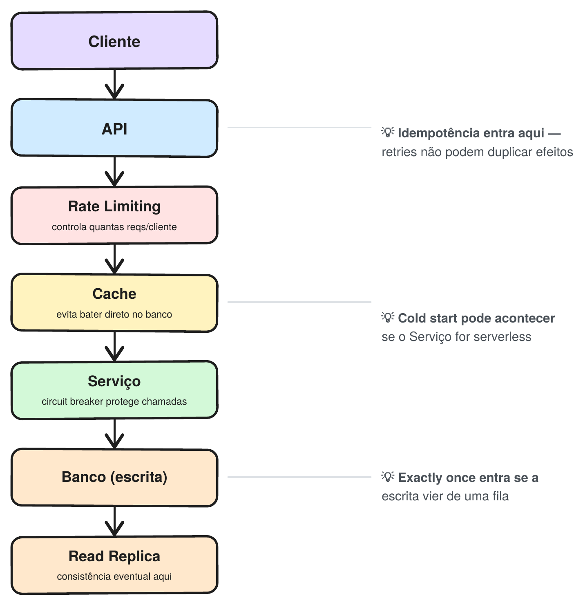

## Seção 1: Dados, consistência e confiabilidade

Todo sistema que lida com mais de uma cópia dos dados, mais de um servidor, ou mais de uma tentativa de fazer a mesma coisa esbarra nos mesmos problemas: requisições podem se repetir, dados demoram pra propagar, caches ficam desatualizados. Os seis conceitos abaixo são, no fundo, respostas a essas perguntas.

## Idempotência

Uma operação é idempotente quando podemos executá-la várias vezes sem alterar o resultado final. Imagine um pagamento: você clica em "Pagar", o servidor processa a cobrança, mas ocorre um erro antes de conseguir responder. Como você não sabe se o pagamento foi concluído, tenta novamente. Se a operação não for idempotente, o servidor pode processar a segunda tentativa como um novo pagamento e você acaba sendo cobrado duas vezes. A idempotência existe justamente para **garantir que repetir uma operação não gere efeitos colaterais duplicados.**

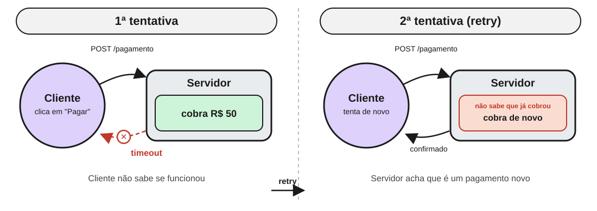

A solução mais comum é a idempotency key: um identificador único para aquela operação, gerado pelo cliente no momento do clique. Pense nela como um número de protocolo da solicitação.

No exemplo do pagamento: na primeira tentativa, o cliente envia a requisição junto com essa chave, e o servidor processa o pagamento normalmente. Se a resposta não chegar (timeout, queda de conexão, erro do servidor), o cliente tenta de novo, mas reenvia a mesma idempotency key. O servidor reconhece a chave repetida e entende: "essa operação já foi processada". Em vez de cobrar de novo, ele apenas devolve o resultado que já tinha gerado.

O fluxo fica mais ou menos assim:

`1ª tentativa → idempotency key: abc-123 → processa o pagamento`

`2ª tentativa → idempotency key: abc-123 → operação já processada → retorna o resultado`

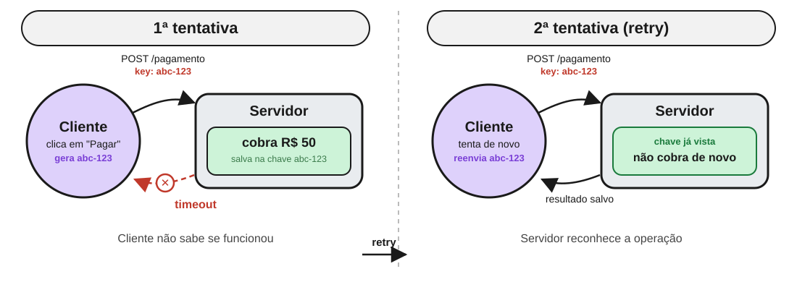

O ponto importante é que a chave identifica a operação, não os dados enviados. É isso que permite ao servidor reconhecer que duas requisições (mesmo separadas por um retry, um timeout ou uma falha de conexão) são, na prática, a mesma tentativa.

Vale lembrar como isso funciona nos verbos HTTP tradicionais: GET, PUT e DELETE já são idempotentes por definição, POST não é, e PATCH depende da implementação. Em outras palavras: idempotência não é sobre "não repetir a ação", é sobre garantir que repetir não cause efeitos colaterais duplicados.

## Consistência eventual

Em sistemas com múltiplos bancos, é comum ter um banco principal responsável pelas escritas e réplicas responsáveis pelas leituras. Quando um dado é alterado, a aplicação grava primeiro no banco principal, e essa alteração só depois é replicada para os bancos de leitura. Com consistência eventual, essa replicação não precisa acontecer instantaneamente: por alguns milissegundos ou segundos, uma leitura pode retornar o valor antigo, até a replicação terminar e todas as cópias ficarem consistentes de novo.

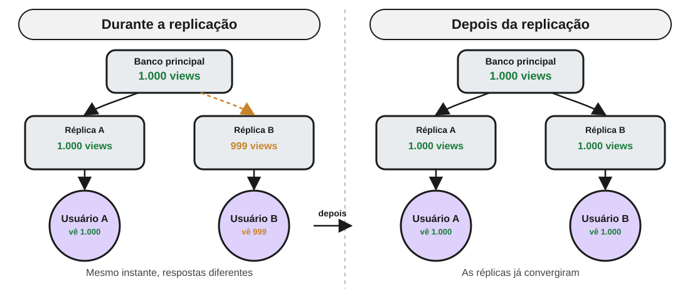

O benefício é ganhar desempenho e disponibilidade, já que a aplicação não precisa esperar todas as réplicas serem atualizadas antes de confirmar a escrita. O custo é aceitar esse período curto de inconsistência. Se quiséssemos que todas as cópias estivessem sempre atualizadas antes de responder ao usuário, teríamos consistência forte, mas isso aumentaria a latência e poderia reduzir a disponibilidade do sistema.

No YouTube, o "+1 view" é salvo instantaneamente no banco principal, mas duas pessoas em países diferentes, consultando a página quase ao mesmo tempo, podem receber `999` e `1.000` visualizações, porque cada uma está lendo de uma réplica diferente: uma já recebeu a atualização, a outra ainda não. O sistema não está quebrado. Ele trocou consistência imediata por velocidade e disponibilidade, de propósito. Para esse tipo de dado, alguns segundos de diferença são aceitáveis; para informações como saldo bancário ou estoque, provavelmente não.

## Read replicas

Read replicas são cópias do banco principal usadas para distribuir as operações de leitura. Em vez de todas as requisições chegarem ao mesmo banco, as escritas continuam indo para o banco principal, enquanto as leituras podem ser distribuídas entre várias réplicas.

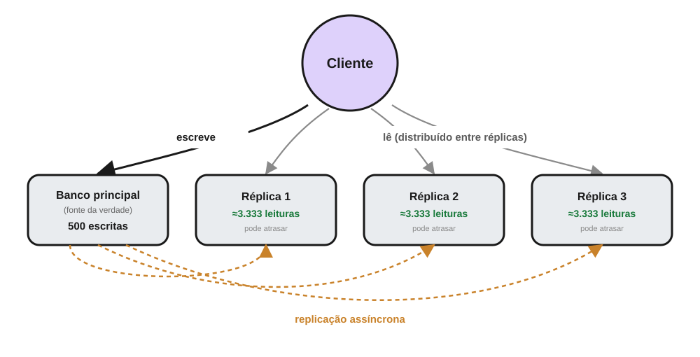

Por exemplo, se uma aplicação recebe 10.000 leituras e apenas 500 escritas, não faz muito sentido sobrecarregar o banco principal com todas essas consultas. As réplicas permitem distribuir essa carga e aumentar a capacidade de leitura do sistema.

A desvantagem é que a replicação geralmente é assíncrona: uma réplica pode levar alguns milissegundos ou segundos para receber uma alteração feita no banco principal. Por isso, read replicas estão diretamente relacionadas à consistência eventual: é exatamente esse atraso de replicação que faz uma réplica responder um valor desatualizado por um tempo curto.

## Teorema de CAP

O Teorema de CAP descreve um trade-off de sistemas distribuídos quando ocorre uma partição de rede, ou seja, quando dois ou mais nós deixam de conseguir se comunicar corretamente. Ele considera três propriedades: Consistency (C): todos os nós retornam o mesmo dado; Availability (A): o sistema continua respondendo às requisições; e Partition Tolerance (P): o sistema continua funcionando mesmo com uma falha na comunicação entre os nós.

Na prática, o P é praticamente obrigatório em sistemas distribuídos, porque não temos como garantir que a rede nunca vai falhar: cabos podem ser rompidos, servidores podem ficar indisponíveis, conexões podem cair. Por isso, quando uma partição acontece, a decisão real passa a ser entre C e A.

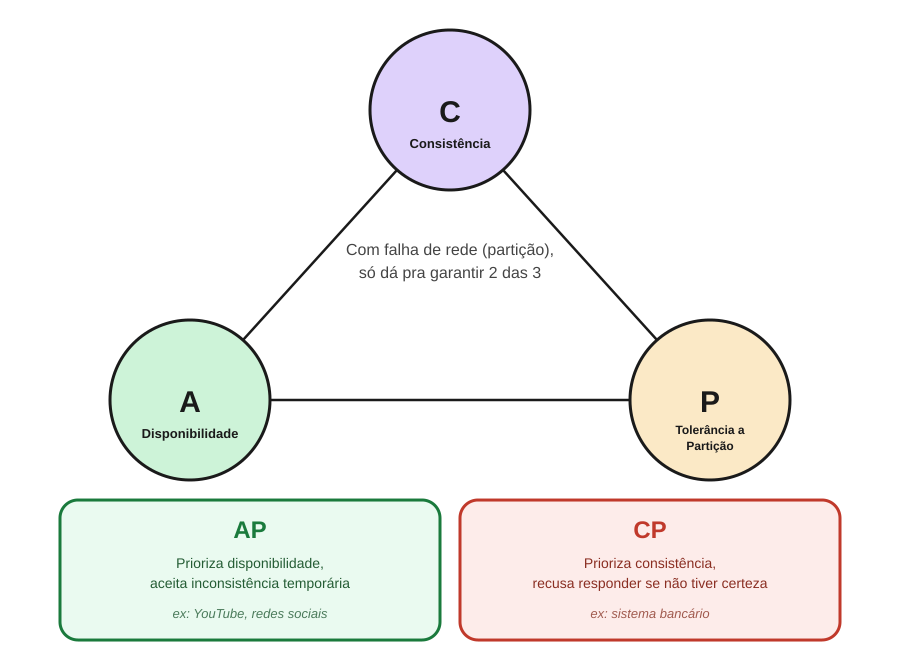

CP prefere manter os dados consistentes, mesmo que precise deixar de responder temporariamente; AP prefere continuar respondendo, mesmo que algumas respostas possam estar temporariamente desatualizadas. Um sistema bancário tende a priorizar consistência: é melhor não realizar uma operação do que correr o risco de trabalhar com um saldo incorreto. Já uma rede social pode priorizar disponibilidade: alguns usuários verem uma informação alguns segundos atrasada geralmente é aceitável. A consistência eventual do item acima é basicamente o que acontece quando um sistema escolhe AP.

## Exactly once

Em sistemas de mensageria, como o Kafka, uma das preocupações é garantir quantas vezes uma mensagem será processada. Existem três garantias principais: at most once: a mensagem pode ser perdida, mas não será processada mais de uma vez; at least once: a mensagem não deve ser perdida, mas pode ser processada mais de uma vez; e exactly once: a mensagem é processada uma única vez.

O problema é que exactly once é muito mais difícil de garantir, principalmente quando o processamento envolve outros sistemas. Imagine um consumidor que recebe uma mensagem para realizar um pagamento: ele processa o pagamento com sucesso, mas falha antes de confirmar ao sistema de mensageria que terminou. Como o sistema de mensageria não sabe se o pagamento realmente aconteceu, ele reenvia a mensagem, e agora existe o risco de processar o pagamento duas vezes.

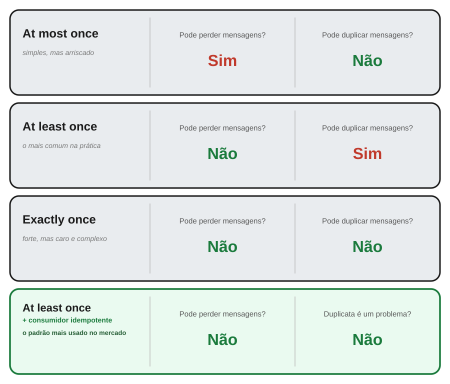

Por isso, garantir exactly once de ponta a ponta é bastante complexo, e geralmente só vale dentro do próprio sistema de mensageria. Na prática, é comum trabalhar com at least once + consumidores idempotentes: a mensagem pode chegar mais de uma vez, mas o consumidor reconhece que aquela operação já foi realizada e evita o efeito duplicado, que é literalmente o conceito de idempotência resolvendo o problema de mensagens duplicadas. Ou seja, em vez de tentar garantir que a mensagem nunca será processada duas vezes, garantimos que processá-la duas vezes não causa problema.

## Cache invalidation

Manter os dados guardados em cache sincronizados com a fonte de verdade, pra ninguém ler um dado desatualizado por tempo indevido.

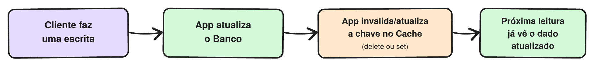

As estratégias mais comuns:

- TTL: o item expira sozinho depois de um tempo fixo. É simples, mas convive com dados desatualizados por definição
- Write-through: toda escrita atualiza o cache na mesma operação. Nunca fica desatualizado, mas cada escrita fica mais lenta
- Cache-aside com invalidação explícita: a aplicação deleta ou atualiza a chave do cache quando escreve no banco, em vez de esperar o TTL. É o padrão mais usado

Essa é só a primeira metade da história: cache invalidation aparece de novo, com mais nuances, na Seção 4.

## Seção 2: Escala, performance e resiliência

Os conceitos desta seção tratam de um problema comum em sistemas reais: o que acontece quando a aplicação recebe mais carga do que consegue processar ou quando algum de seus componentes começa a falhar?

## Backpressure

Backpressure é uma forma de controlar o fluxo quando um componente produz trabalho mais rápido do que outro consegue processar.

Imagine um serviço produzindo 20 mensagens por segundo, enquanto o consumidor consegue processar apenas 5. Sem controle, a fila cresce continuamente até consumir recursos e causar problemas.

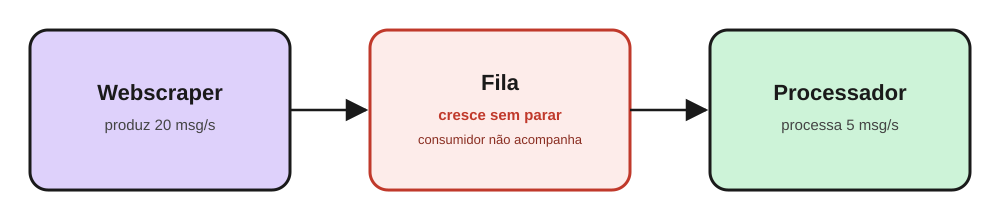

A ideia do backpressure é dar ao consumidor um jeito de avisar "não aguento mais" antes que a fila vire um problema, e isso pode ser feito de algumas formas: o produtor desacelera e passa a gerar menos trabalho por segundo; a fila ganha um tamanho máximo e passa a bloquear ou rejeitar novas mensagens quando enche; ou o consumidor ganha mais capacidade, seja escalando horizontalmente, seja otimizando o próprio processamento.

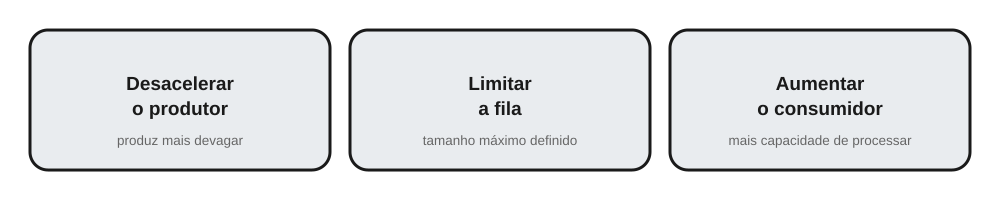

Se quem consome não consegue acompanhar quem produz, é preciso controlar o ritmo.

## Thundering Herd Problem

O Thundering Herd Problem acontece quando muitas requisições tentam fazer a mesma coisa ao mesmo tempo, geralmente depois de uma falha ou expiração de cache.

Imagine um conteúdo muito acessado que está no cache. Quando ele expira, milhares de usuários podem tentar buscá-lo simultaneamente no banco, gerando uma carga enorme justamente quando o sistema já está vulnerável.

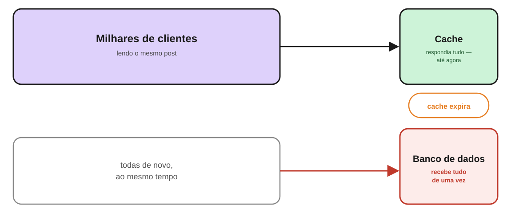

Uma forma de evitar isso é usar jitter: em vez de todo mundo tentar de novo no mesmo instante, cada cliente espera um tempo aleatório antes do retry, espalhando a carga ao longo de alguns segundos em vez de concentrá-la num único pico. Outra é request coalescing: quando várias requisições pedem o mesmo dado ao mesmo tempo, apenas a primeira de fato vai até o banco. As demais ficam esperando e recebem o mesmo resultado assim que ele chega, em vez de gerar N consultas idênticas.

## Celebrity Problem / Hot Shards

O Hot Shard acontece quando um sistema particionado distribui os dados entre vários shards, mas uma chave específica recebe uma quantidade enorme de acessos.

Imagine uma rede social que distribui posts entre diferentes shards. Se uma celebridade publica algo viral e todos os acessos daquele conteúdo caem no mesmo shard, ele pode ficar sobrecarregado enquanto os outros continuam praticamente ociosos.

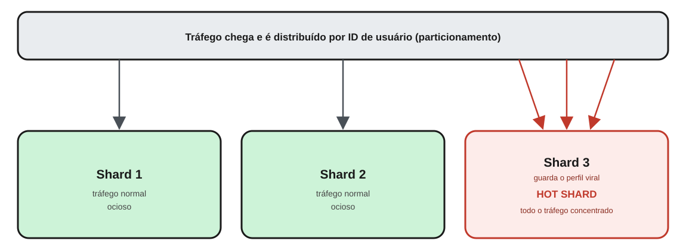

Cache na frente do shard quente absorve boa parte das leituras antes que cheguem ao banco. Réplicas de leitura para aquela chave específica distribuem o tráfego entre várias cópias, em vez de concentrar tudo numa única instância. E uma distribuição mais granular (particionar por algum atributo além do autor, por exemplo) evita que um único registro popular consiga sozinho lotar um shard inteiro.

Ter vários servidores não ajuda se todo o tráfego continua concentrado em um único lugar.

## Circuit Breaker

O Circuit Breaker evita que uma aplicação continue tentando chamar um serviço que está falhando.

Ele funciona de forma parecida com um disjuntor elétrico:

- Closed: tudo funciona normalmente.
- Open: após várias falhas, as chamadas são bloqueadas imediatamente.
- Half-open: algumas chamadas de teste são liberadas para verificar se o serviço voltou.

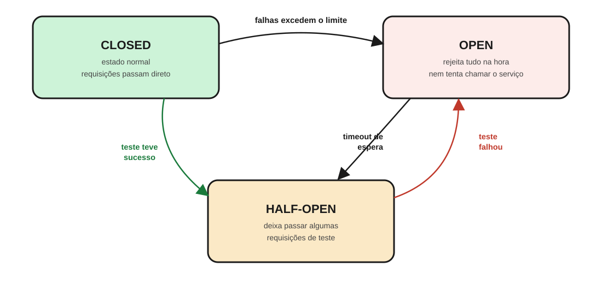

Assim, em vez de esperar um timeout completo a cada tentativa (o que consome tempo, threads e conexões enquanto o serviço já está com problema), o sistema falha rapidamente assim que percebe o padrão de falhas. Isso evita que a lentidão de um serviço se propague para quem depende dele, formando uma fila crescente de requisições presas esperando uma resposta que não vai chegar. E o estado half-open garante que o sistema volte a confiar no serviço automaticamente assim que ele se recuperar, sem precisar de intervenção manual.

## Rate Limiting

Rate limiting limita quantas requisições um cliente pode fazer em determinado período.

Por exemplo: 100 requisições por minuto por usuário.

Isso ajuda a proteger a aplicação contra abuso e picos de tráfego.

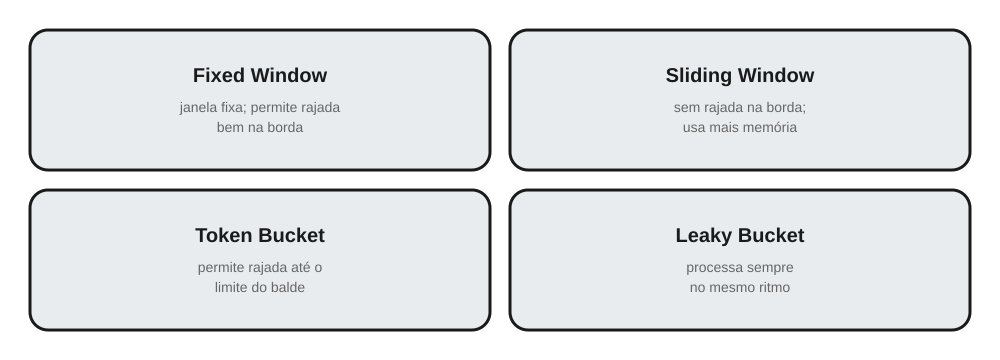

Existem diferentes estratégias para implementar isso. Fixed Window conta as requisições dentro de janelas fixas de tempo (por exemplo, a cada minuto). É simples, mas permite uma rajada dupla bem na virada da janela. Sliding Window resolve esse problema considerando uma janela contínua que desliza com o tempo, ao custo de mais memória. Token Bucket acumula "tokens" num ritmo constante e cada requisição consome um deles, permitindo rajadas ocasionais enquanto o balde não esvazia. Leaky Bucket força as requisições a serem processadas sempre no mesmo ritmo, não importa como elas chegaram, suavizando qualquer rajada.

A ideia principal é simples: não deixe um único cliente consumir toda a capacidade do sistema.

## Cold Start

Cold Start é a latência adicional que pode acontecer em aplicações serverless quando uma função precisa ser inicializada antes de executar.

Em uma AWS Lambda, por exemplo, se não houver uma instância pronta, a plataforma precisa preparar o ambiente, inicializar o runtime e só então executar o código. Isso torna a primeira requisição mais lenta.

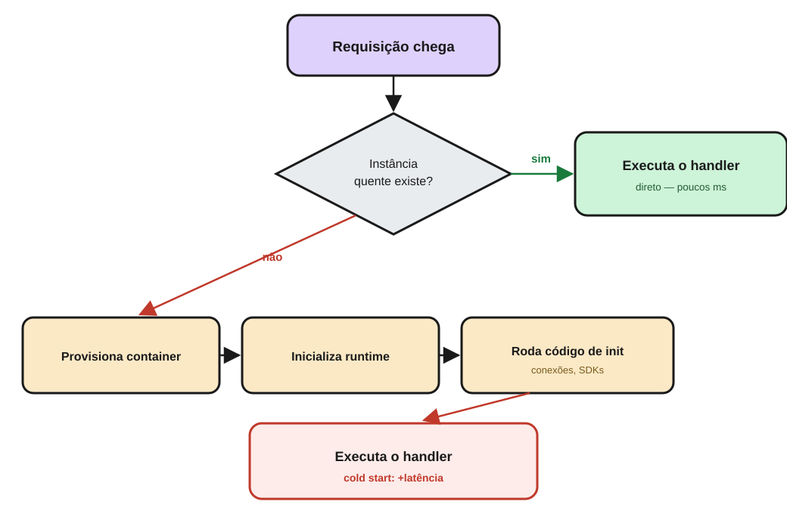

Algumas formas de reduzir o impacto: Provisioned Concurrency mantém um número mínimo de instâncias sempre quentes, prontas para receber requisições mesmo sem tráfego constante, trocando custo por latência previsível. Pacotes de deploy menores fazem o runtime inicializar mais rápido, já que há menos código e dependências para carregar. E inicializar conexões (banco, cache, SDKs) fora do handler, na fase de setup da função, evita que esse custo seja pago em toda invocação fria e permite reaproveitar a mesma conexão entre chamadas na mesma instância.

Serverless não elimina o custo de inicialização. Apenas transfere essa responsabilidade para a plataforma.

## Seção 3: Evolução e migração de sistemas

Até aqui, os conceitos estavam mais ligados a manter o sistema funcionando sob carga. Agora, o foco é outro: como mudar um sistema em produção sem precisar pará-lo ou quebrar quem ainda depende da versão antiga.

## Expand-Contract

Expand-Contract é uma estratégia para fazer mudanças de schema de forma segura e sem downtime. Em vez de alterar tudo de uma vez, a mudança é dividida em etapas menores, permitindo que versões antigas e novas do sistema coexistam durante a transição.

Imagine que você precisa renomear a coluna `endereco` para `full_address` numa tabela de usuários que está em produção, sendo lida e escrita por várias instâncias da aplicação ao mesmo tempo. Se você simplesmente renomear a coluna direto no banco, todas as instâncias que ainda esperam `endereco` quebram na hora. Não existe um jeito de fazer o banco e todas as réplicas do código mudarem no mesmo instante.

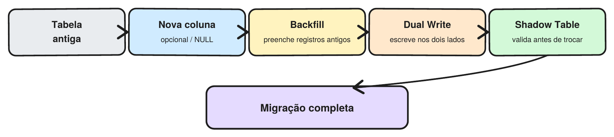

A ideia é simples: primeiro adicionamos o que é necessário (expand), depois migramos os dados e o código para usar a nova estrutura, e por fim removemos o que ficou obsoleto (contract). No exemplo da coluna:

- Expand: criamos a coluna `full_address` nova, sem tocar na `endereco`. O banco passa a ter as duas colunas, e o código antigo continua funcionando normalmente, sem nem saber que a nova existe.
- Migração: um job de backfill preenche `full_address` para os registros que já existiam, e o código passa a escrever nas duas colunas ao mesmo tempo (dual writes), garantindo que nenhuma escrita nova fique desatualizada em nenhuma das duas.
- Contract: depois que todas as instâncias da aplicação já leem e escrevem só em `full_address`, e os dados foram validados como consistentes, a coluna `endereco` é removida.

Os principais mecanismos usados nesse processo são backfill, dual writes e shadow tables: cada um resolve uma parte específica dessa transição, e cada um é detalhado logo abaixo.

## Feature Flags

Feature Flags são "interruptores" que permitem ativar ou desativar uma funcionalidade sem fazer um novo deploy.

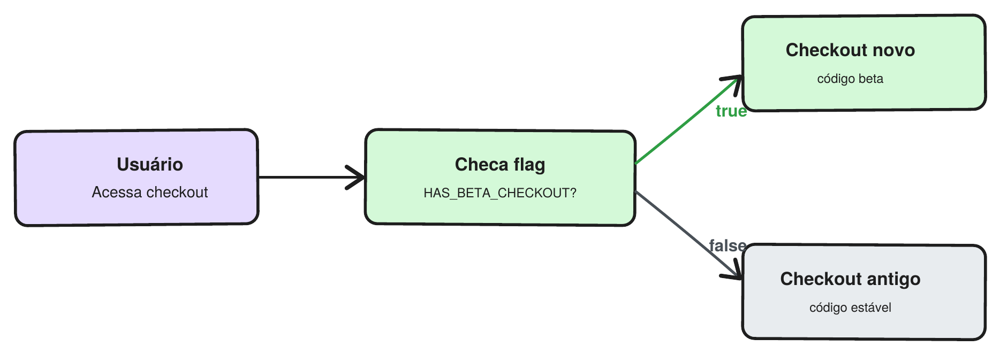

Por exemplo, uma nova funcionalidade pode ser liberada primeiro para 1% dos usuários, depois 10% e, se tudo estiver funcionando bem, para 100%.

Também podem funcionar como um kill switch: se algo der errado, a funcionalidade pode ser desativada rapidamente.

Deployar o código não significa necessariamente liberar a funcionalidade.

O cuidado é não deixar flags antigas espalhadas pelo código. O ideal é que cada uma tenha um responsável e uma data para ser removida.

## Schema Evolution

Schema Evolution é a capacidade de mudar a estrutura dos dados sem quebrar as aplicações que ainda utilizam a versão antiga.

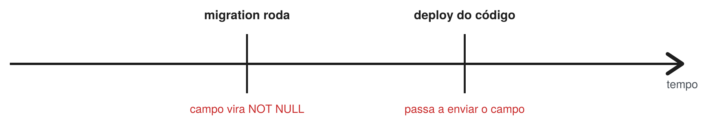

Imagine que queremos adicionar um novo campo obrigatório a uma tabela. Se o banco passar a exigir esse campo antes que todas as versões da aplicação estejam preparadas para enviá-lo, requisições antigas podem começar a falhar.

Por isso, a mudança é feita gradualmente: adicionar → preencher → utilizar → tornar obrigatório → remover o antigo.

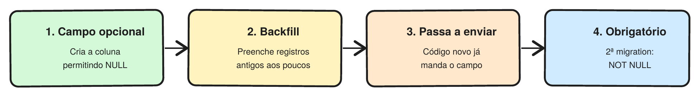

Cada etapa pode ser implantada e validada separadamente, evitando uma mudança que quebre o sistema de uma vez.

## Backfill

Backfill é o processo de preencher um novo campo para dados que já existiam antes da mudança.

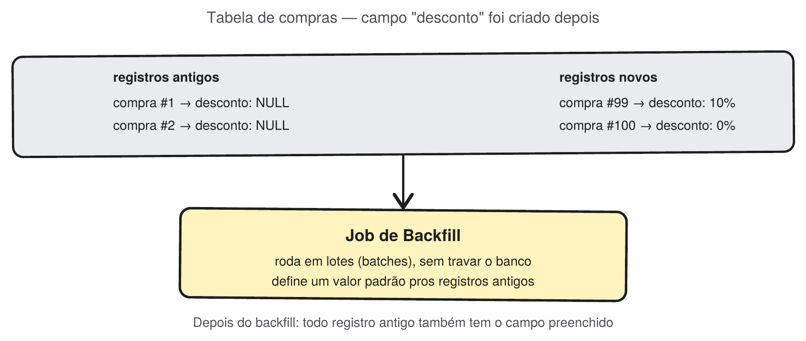

Por exemplo, se adicionarmos o campo `country` a uma tabela com milhões de usuários, o backfill será responsável por preencher esse campo nos registros antigos.

Normalmente, isso é feito em pequenos lotes, evitando sobrecarregar ou bloquear o banco. Backfill cuida de levar os dados antigos para o novo formato.

## Dual Writes

Dual Writes acontecem quando, durante uma migração, a aplicação passa a escrever tanto no formato antigo quanto no novo.

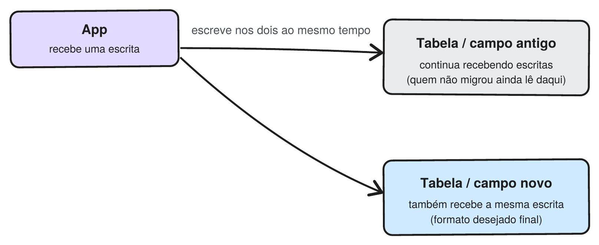

Isso permite que partes do sistema continuem utilizando o formato antigo enquanto outras já trabalham com o novo.

O principal problema é a possibilidade de inconsistência. Se a escrita funcionar em um lugar e falhar no outro, os dados ficam diferentes e será necessário fazer uma reconciliação. Dual writes mantêm os formatos antigo e novo sincronizados durante a transição.

## Shadow Tables

Shadow Tables consistem em criar uma nova tabela em paralelo à antiga e copiar os dados para ela enquanto o sistema continua funcionando normalmente.

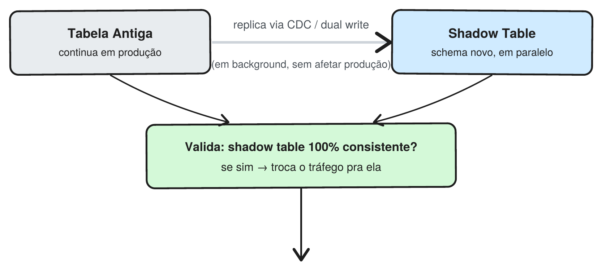

Depois, a nova tabela pode ser validada antes de receber o tráfego real. Se tudo estiver correto, a aplicação pode ser direcionada para ela de forma controlada.

A vantagem é ter uma migração mais segura e reversível, já que a tabela antiga continua disponível durante a transição. Shadow Tables permitem preparar e validar o novo formato antes de colocá-lo em produção.

## Como tudo se conecta?

Esses conceitos trabalham juntos durante uma migração:

- Backfill: leva os dados antigos para o novo formato.
- Dual Writes: mantém os formatos antigo e novo sincronizados.
- Shadow Tables: permite validar o novo formato antes da troca.
- Expand-Contract: organiza todo esse processo em etapas seguras.

A ideia principal é não tentar mudar tudo de uma vez. Sistemas em produção precisam evoluir gradualmente, mantendo as versões antiga e nova funcionando até que a migração esteja completa.

## Seção 4: Arquitetura e System Design

Os últimos conceitos conectam os temas anteriores e mostram como diferentes técnicas podem ser combinadas para construir sistemas mais robustos e preparados para produção.

## Cache Invalidation em múltiplas camadas

Na prática, um mesmo dado pode estar armazenado em vários níveis de cache: navegador, CDN, cache da aplicação e até réplicas do banco.

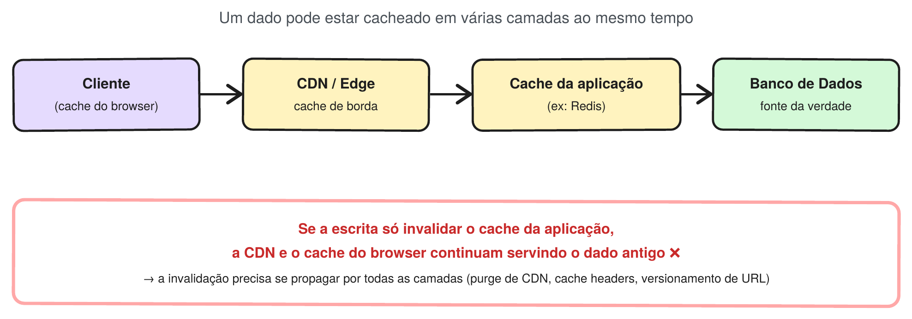

O problema é que atualizar o banco não significa que todos esses caches foram atualizados. Se apenas o Redis for invalidado, por exemplo, a CDN ainda pode entregar o valor antigo.

Por isso, a invalidação precisa considerar todas as camadas, usando estratégias como purge de CDN, cache headers e versionamento de URLs.

Quanto mais camadas de cache, mais difícil garantir que todos estejam atualizados.

## Transações distribuídas

Uma transação distribuída acontece quando uma operação depende de vários serviços e precisamos garantir que o resultado final seja consistente.

Imagine uma compra que reserva voo, hotel e aluguel de carro. Se o hotel for reservado, mas o aluguel do carro falhar, precisamos decidir o que fazer com as reservas que já foram realizadas.

Existem duas abordagens comuns:

- Two-Phase Commit (2PC): um coordenador garante que todos os serviços estejam prontos antes de confirmar a operação. É consistente, mas pode exigir bloqueios e ter problemas de escalabilidade.
- Saga: cada serviço confirma sua parte localmente. Se uma etapa falhar, são executadas ações compensatórias para desfazer as etapas anteriores.

A Saga costuma ser mais adequada para sistemas distribuídos, mas adiciona complexidade ao controle e à recuperação das operações.

## Saga Orchestration

Na orquestração, existe um componente central que controla o fluxo da transação.

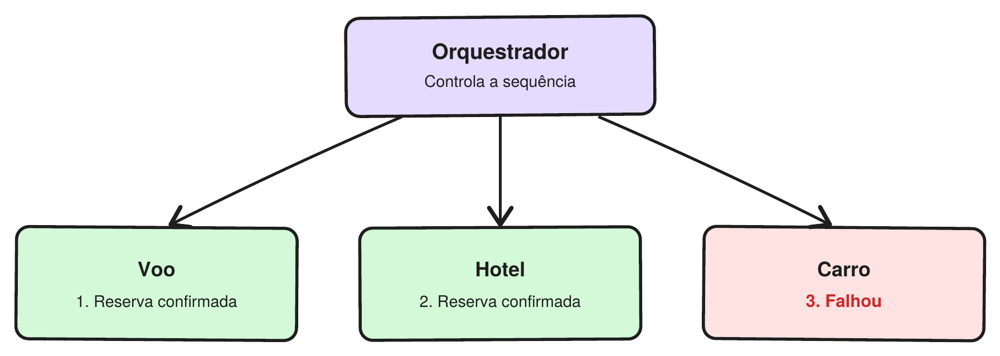

Por exemplo: `Orquestrador → voo → hotel → carro`.

Se o carro falhar, o orquestrador sabe que precisa executar as compensações do hotel e do voo.

A vantagem é ter um único lugar controlando o fluxo, facilitando o entendimento e o debug. Em contrapartida, esse componente cria um maior acoplamento entre os serviços.

## Saga Choreography

Na coreografia, não existe um coordenador central. Os próprios serviços se comunicam por meio de eventos.

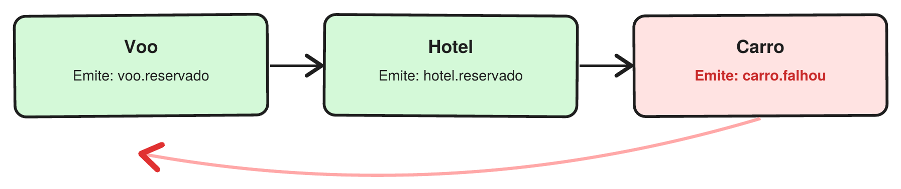

Por exemplo: `carro.falhou → evento → voo e hotel executam suas compensações`.

Isso deixa os serviços mais desacoplados, mas torna o fluxo mais difícil de entender e rastrear quando existem muitas etapas.

Orquestração centraliza o fluxo; coreografia distribui a responsabilidade entre os serviços.

## System Design

System Design não é apenas mais um conceito da lista. É a capacidade de combinar os conceitos anteriores para tomar decisões de arquitetura.

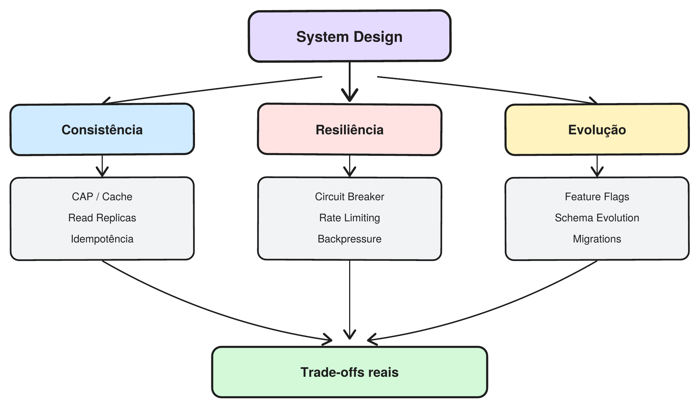

Por exemplo:

- Esse sistema precisa de consistência forte ou eventual?
- Onde ele pode quebrar quando a carga aumentar?
- Precisamos de cache, read replicas ou rate limiting?
- Vale a complexidade de um Circuit Breaker?
- Como mudar o schema sem quebrar versões antigas?

O ponto não é usar todas essas técnicas, mas entender qual problema cada uma resolve e quais trade-offs ela traz.

System Design é saber escolher as ferramentas certas para cada problema.

No fim, um desenvolvedor mais experiente não é necessariamente quem conhece mais tecnologias. É quem consegue identificar problemas, avaliar trade-offs e tomar decisões conscientes sobre como o sistema deve funcionar em produção.
