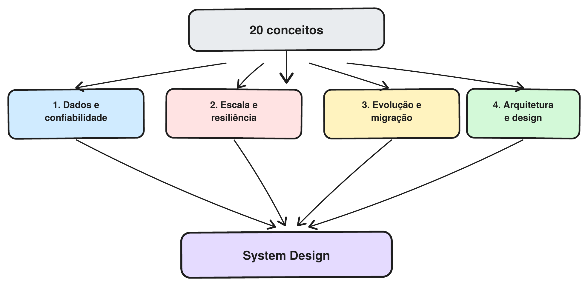

This post is a general roundup of the video "20 Concepts That Separate Junior from Senior Devs," by Augusto Galego (https://www.youtube.com/watch?v=7lH36O1Pudg), summarizing the 20 concepts he presents and explaining each one. I organized everything into 4 groups: data and reliability, scale and resilience, evolution and migration, and architecture.

Before diving into each group, it's worth visualizing where most of these concepts show up in practice, along the path of a single request, from the client to the database:

## Section 1: Data, consistency, and reliability

Any system dealing with more than one copy of its data, more than one server, or more than one attempt at doing the same thing runs into the same problems: requests can repeat, data takes time to propagate, caches go stale. The six concepts below are, at their core, answers to those same questions.

## Idempotency

An action is idempotent when running it once or three times produces exactly the same result. Imagine a payment that fails to confirm because of a server error, even though it was already processed. The customer clicks "pay" again, and without idempotency they get charged twice.

The most common solution is the idempotency key: the client generates a unique identifier at the moment of the click and resends that same key on any retry of that action. The server recognizes the repeated key and returns the response it already generated, without processing again.

It's worth remembering how this works with traditional HTTP verbs: GET, PUT, and DELETE are already idempotent by definition, POST is not, and PATCH depends on the implementation. In other words: idempotency isn't about "not repeating the action," it's about guaranteeing that repeating it doesn't cause duplicate side effects.

## Eventual consistency

In systems with multiple databases, it's common to have one primary database that handles writes and replicas that handle reads. When a piece of data changes, the application writes to the primary first, and that change is only replicated to the read databases afterward. With eventual consistency, that replication doesn't need to happen instantly: for a few milliseconds or seconds, a read can return the old value, until replication finishes and every copy is consistent again.

The benefit is gaining performance and availability, since the application doesn't have to wait for every replica to update before confirming the write. The cost is accepting that short window of inconsistency. If we wanted every copy to always be up to date before answering the user, we'd have strong consistency instead, but that increases latency and can reduce the system's availability.

On YouTube, the "+1 view" is saved instantly to the primary database, but two people in different countries querying the page at nearly the same moment might get back `999` and `1,000` views, because each one is reading from a different replica: one already got the update, the other hasn't yet. The system isn't broken. It deliberately traded immediate consistency for speed and availability. For that kind of data, a few seconds of difference is acceptable; for something like a bank balance or inventory count, it probably isn't.

## Read replicas

Read replicas are copies of the primary database used to spread out read operations. Instead of every request hitting the same database, writes keep going to the primary, while reads can be distributed across several replicas.

For example, if an application gets 10,000 reads and only 500 writes, it doesn't make much sense to load all of those queries onto the primary. Replicas let you spread that load out and increase the system's read capacity.

The downside is that replication is usually asynchronous: a replica can take a few milliseconds or seconds to receive a change made on the primary. That's why read replicas are directly tied to eventual consistency: that replication lag is exactly what makes a replica answer with a stale value for a short while.

## The CAP theorem

The CAP theorem describes a distributed-systems trade-off that kicks in during a network partition, when two or more nodes stop being able to communicate correctly. It considers three properties: Consistency (C): every node returns the same data; Availability (A): the system keeps responding to requests; and Partition Tolerance (P): the system keeps working even when communication between nodes fails.

In practice, P is basically mandatory in distributed systems, since there's no way to guarantee the network will never fail: cables get cut, servers go down, connections drop. So once a partition happens, the real decision is between C and A.

CP would rather keep the data consistent, even if that means temporarily refusing to respond; AP would rather keep responding, even if some answers might be temporarily stale. A banking system tends to prioritize consistency: it's better to refuse an operation than risk working with an incorrect balance. A social network, on the other hand, can prioritize availability: a few users seeing information that's a couple seconds stale is usually fine. The eventual consistency from the item above is basically what happens when a system chooses AP.

## Exactly once

In messaging systems like Kafka, one of the concerns is guaranteeing how many times a message gets processed. There are three main guarantees: at most once: the message can be lost, but won't be processed more than once; at least once: the message won't be lost, but can be processed more than once; and exactly once: the message is processed exactly one time.

The problem is that exactly once is much harder to guarantee, especially when processing involves other systems. Imagine a consumer that receives a message to charge a payment: it processes the payment successfully, but fails before confirming to the messaging system that it's done. Since the messaging system doesn't know whether the payment actually went through, it redelivers the message, and now there's a risk of charging the payment twice.

That's why guaranteeing exactly once end-to-end is quite complex, and it usually only holds within the messaging system itself. In practice, it's common to work with at least once + idempotent consumers: the message might arrive more than once, but the consumer recognizes that the operation already happened and avoids the duplicate effect, which is literally the idempotency concept solving the duplicate-message problem. In other words, instead of trying to guarantee a message is never processed twice, we guarantee that processing it twice causes no problem.

## Cache invalidation

Keeping cached data in sync with the source of truth, so nobody reads a stale value for longer than they should.

The most common strategies:

- TTL: the item expires on its own after a fixed time. Simple, but it lives with stale data by definition
- Write-through: every write updates the cache in the same operation. Never stale, but every write gets slower
- Cache-aside with explicit invalidation: the application deletes or updates the cache key when it writes to the database, instead of waiting for the TTL. The most commonly used pattern

This is only the first half of the story: cache invalidation shows up again, with more nuance, in Section 4.

## Section 2: Scale, performance, and resilience

The concepts in this section deal with a common problem in real systems: what happens when the application receives more load than it can process, or when one of its components starts failing?

## Backpressure

Backpressure is a way to control flow when one component produces work faster than another one can process it.

Imagine a service producing 20 messages per second, while the consumer can only process 5. With no control, the queue keeps growing until it eats up resources and causes problems.

The idea behind backpressure is to give the consumer a way to say "I can't keep up" before the queue turns into a problem, and that can happen in a few ways: the producer slows down and generates less work per second; the queue gets a maximum size and starts blocking or rejecting new messages once it's full; or the consumer gets more capacity, either by scaling horizontally or by optimizing its own processing.

If the consumer can't keep up with the producer, someone has to control the pace.

## Thundering Herd Problem

The Thundering Herd Problem happens when many requests try to do the same thing at the same time, usually right after a failure or a cache expiration.

Imagine a heavily accessed piece of content sitting in cache. When it expires, thousands of users may try to fetch it from the database at the same time, creating a huge load right when the system is already vulnerable.

One way to avoid this is using jitter: instead of everyone retrying at the exact same instant, each client waits a random amount of time before retrying, spreading the load over a few seconds instead of concentrating it in a single spike. Another is request coalescing: when several requests ask for the same data at the same time, only the first one actually goes to the database. The rest wait and get the same result as soon as it arrives, instead of triggering N identical queries.

## Celebrity Problem / Hot Shards

A Hot Shard happens when a partitioned system distributes data across several shards, but one specific key receives a huge amount of traffic.

Imagine a social network that distributes posts across different shards. If a celebrity posts something viral and all the traffic for that content lands on the same shard, it can get overloaded while the others sit practically idle.

Caching in front of the hot shard absorbs a good chunk of the reads before they ever reach the database. Read replicas for that specific key spread the traffic across several copies instead of concentrating it on a single instance. And a more granular distribution (partitioning by some attribute other than the author, for example) keeps a single popular record from being able to fill up an entire shard on its own.

Having several servers doesn't help if all the traffic keeps hitting a single one of them.

## Circuit Breaker

The Circuit Breaker stops an application from continuing to call a service that's failing.

It works similarly to an electrical breaker:

- Closed: everything works normally.
- Open: after several failures, calls are blocked immediately.
- Half-open: a few test calls are let through to check if the service has recovered.

This way, instead of waiting out a full timeout on every attempt (which burns time, threads, and connections while the service is already struggling), the system fails fast as soon as it notices the failure pattern. That keeps a slow service from propagating its slowness to everything that depends on it, piling up a growing queue of requests stuck waiting for a response that isn't coming. And the half-open state lets the system automatically start trusting the service again once it recovers, with no manual intervention needed.

## Rate Limiting

Rate limiting caps how many requests a client can make in a given period.

For example: 100 requests per minute per user.

This helps protect the application against abuse and traffic spikes.

There are different strategies for implementing this. Fixed Window counts requests within fixed time windows (every minute, say). It's simple, but allows a double burst right at the window boundary. Sliding Window fixes that by considering a continuous window that slides over time, at the cost of more memory. Token Bucket accumulates "tokens" at a steady rate and each request consumes one, allowing occasional bursts as long as the bucket isn't empty. Leaky Bucket forces requests to be processed at a constant rate no matter how they arrived, smoothing out any burst.

The main idea is simple: don't let a single client consume the whole capacity of the system.

## Cold Start

Cold Start is the extra latency that can happen in serverless applications when a function needs to be initialized before it runs.

In AWS Lambda, for example, if there's no instance ready, the platform needs to prepare the environment, initialize the runtime, and only then run the code. That makes the first request slower.

Some ways to reduce the impact: Provisioned Concurrency keeps a minimum number of instances always warm and ready to take requests, even with no steady traffic, trading cost for predictable latency. Smaller deploy packages make the runtime initialize faster, since there's less code and fewer dependencies to load. And initializing connections (database, cache, SDKs) outside the handler, during the function's setup phase, keeps that cost from being paid on every cold invocation and lets the same connection be reused across calls on the same instance.

Serverless doesn't eliminate the cost of initialization. It just shifts that responsibility to the platform.

## Section 3: Evolving and migrating systems

Up to this point, the concepts were more about keeping the system running under load. Now the focus shifts: how do you change a system in production without having to stop it, or breaking whoever still depends on the old version?

## Expand-Contract

Expand-Contract is a strategy for making schema changes safely and without downtime. Instead of changing everything at once, the change is broken into smaller steps, letting the old and new versions of the system coexist during the transition.

Imagine you need to rename the `address` column to `full_address` on a users table that's in production, being read and written by several instances of the application at the same time. If you simply rename the column directly in the database, every instance that still expects `address` breaks instantly. There's no way to make the database and every replica of the code change at the exact same moment.

The idea is simple: first we add whatever is needed (expand), then we migrate the data and the code to use the new structure, and finally we remove whatever became obsolete (contract). In the column example:

- Expand: we create the new `full_address` column, without touching `address`. The database now has both columns, and the old code keeps working normally, not even aware the new one exists.
- Migration: a backfill job fills in `full_address` for records that already existed, and the code starts writing to both columns at the same time (dual writes), making sure no new write goes stale in either one.
- Contract: once every instance of the application only reads and writes `full_address`, and the data has been validated as consistent, the `address` column is removed.

The main mechanisms used in this process are backfill, dual writes, and shadow tables: each one handles a specific part of that transition, and each is covered in detail below.

## Feature Flags

Feature Flags are "switches" that let you turn a feature on or off without doing a new deploy.

For example, a new feature can be rolled out first to 1% of users, then 10%, and if everything's working fine, to 100%.

They can also work as a kill switch: if something goes wrong, the feature can be turned off quickly.

Deploying the code doesn't necessarily mean releasing the feature.

The catch is not leaving old flags scattered around the codebase. Ideally, each one has an owner and a removal date.

## Schema Evolution

Schema Evolution is the ability to change the structure of the data without breaking applications that still use the old version.

Imagine we want to add a new required field to a table. If the database starts requiring that field before every version of the application is ready to send it, old requests can start failing.

That's why the change is made gradually: add → backfill → use → make required → remove the old one.

Each step can be deployed and validated separately, avoiding a single change that breaks the system all at once.

## Backfill

Backfill is the process of filling in a new field for data that already existed before the change.

For example, if we add a `country` field to a table with millions of users, the backfill is responsible for filling in that field on the old records.

This is usually done in small batches, avoiding overloading or locking the database. Backfill takes care of bringing the old data into the new format.

## Dual Writes

Dual Writes happen when, during a migration, the application starts writing to both the old format and the new one.

This lets parts of the system keep using the old format while others already work with the new one.

The main problem is the possibility of inconsistency. If one write succeeds and the other fails, the data ends up diverging and needs to be reconciled. Dual writes keep the old and new formats in sync during the transition.

## Shadow Tables

Shadow Tables involve creating a new table alongside the old one and copying the data into it while the system keeps running normally.

Afterward, the new table can be validated before it receives real traffic. If everything checks out, the application can be pointed to it in a controlled way.

The advantage is a safer, reversible migration, since the old table stays available throughout the transition. Shadow Tables let you prepare and validate the new format before putting it into production.

## How does it all connect?

These concepts work together during a migration:

- Backfill: brings the old data into the new format.
- Dual Writes: keeps the old and new formats in sync.
- Shadow Tables: lets you validate the new format before the switch.
- Expand-Contract: organizes this whole process into safe steps.

The main idea is not to try to change everything at once. Systems in production need to evolve gradually, keeping the old and new versions running until the migration is complete.

## Section 4: Architecture and System Design

The final concepts connect the previous topics and show how different techniques can be combined to build systems that are more robust and production-ready.

## Cache Invalidation across multiple layers

In practice, the same piece of data can be stored at several caching levels: the browser, a CDN, the application cache, and even database replicas.

The problem is that updating the database doesn't mean all of those caches got updated too. If only Redis gets invalidated, for example, the CDN can still serve the old value.

That's why invalidation needs to account for every layer, using strategies like CDN purges, cache headers, and URL versioning.

The more cache layers there are, the harder it is to guarantee they're all up to date.

## Distributed transactions

A distributed transaction happens when an operation depends on several services and we need to guarantee the final result is consistent.

Imagine a purchase that books a flight, a hotel, and a car rental. If the hotel gets booked but the car rental fails, we need to decide what to do with the bookings that already went through.

There are two common approaches:

- Two-Phase Commit (2PC): a coordinator makes sure every service is ready before confirming the operation. It's consistent, but can require locking and run into scalability problems.
- Saga: each service commits its own part locally. If a step fails, compensating actions run to undo the previous steps.

Saga tends to be a better fit for distributed systems, but it adds complexity to controlling and recovering the operation.

## Saga Orchestration

In orchestration, a central component controls the flow of the transaction.

For example: `Orchestrator → flight → hotel → car`.

If the car step fails, the orchestrator knows it needs to run the compensations for the hotel and the flight.

The advantage is having a single place controlling the flow, which makes it easier to understand and debug. On the other hand, that component creates more coupling between the services.

## Saga Choreography

In choreography, there's no central coordinator. The services themselves communicate through events.

For example: `car.failed → event → flight and hotel run their compensations`.

This makes the services more decoupled, but makes the flow harder to understand and trace when there are many steps.

Orchestration centralizes the flow; choreography spreads the responsibility across the services.

## System Design

System Design isn't just another item on the list. It's the ability to combine the previous concepts to make architecture decisions.

For example:

- Does this system need strong consistency, or is eventual consistency enough?
- Where is it likely to break first as load increases?
- Do we need caching, read replicas, or rate limiting?
- Is the complexity of a Circuit Breaker worth it here?
- How do we change the schema without breaking old versions?

The point isn't to use every one of these techniques, but to understand which problem each one solves and which trade-offs it brings.

System Design is knowing how to pick the right tool for each problem.

In the end, a more experienced developer isn't necessarily the one who knows the most technologies. It's the one who can identify problems, weigh trade-offs, and make conscious decisions about how the system should behave in production.
