*Estudar melhor não é consumir mais informação. É transformar informação em conhecimento que você consegue compreender, lembrar e aplicar.*

Vivemos em uma época em que aprender parece fácil: há cursos, vídeos, livros, documentação, artigos científicos, comunidades e ferramentas de inteligência artificial para praticamente qualquer assunto. O problema é que **acesso à informação não é sinônimo de aprendizagem**.

É possível passar horas assistindo a tutoriais de programação, salvar dezenas de artigos e terminar o dia sem conseguir construir algo sozinho. Também é possível reler uma matéria várias vezes e sentir que ela está familiar, mas travar quando precisamos explicá-la sem consultar a fonte.

Este artigo parte de dois vídeos — *Como estudar melhor*, de Eslen Delanogare, e *How to Remember Everything You Read*, de Justin Sung — para discutir o que a ciência da aprendizagem pode nos ensinar sobre memória, compreensão, prática e retenção. A proposta não é oferecer uma técnica milagrosa, mas construir um sistema de estudo que faça sentido para estudantes e profissionais de tecnologia.

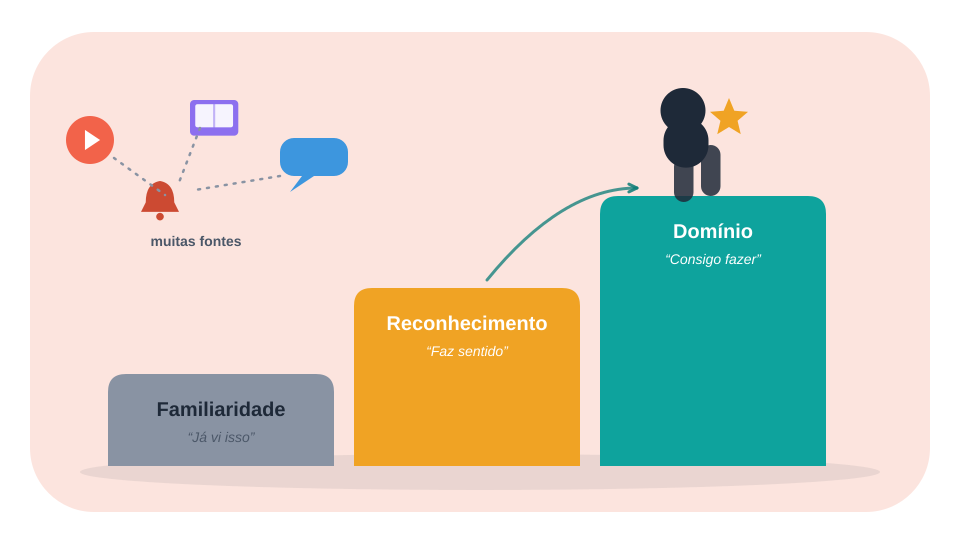

## Seção 1: O problema de estudar em um mundo cheio de informação

O primeiro desafio moderno não é encontrar conteúdo. É selecionar, processar e transformar conteúdo em competência.

Um estudante de engenharia de software pode aprender sobre uma linguagem por meio de:

- vídeos;
- cursos;
- documentação oficial;
- posts;
- fóruns;
- artigos;
- exemplos de código;
- projetos de outras pessoas;
- ferramentas de IA.

Tudo isso pode ser útil. Porém, quando o estudo se resume a consumir fontes, o aluno pode confundir três coisas diferentes:

- **Familiaridade:** "Eu já vi esse assunto."
- **Reconhecimento:** "Quando leio, parece fazer sentido."
- **Domínio:** "Consigo explicar, recuperar e aplicar sem depender da fonte."

A diferença entre essas três experiências é fundamental. A familiaridade pode criar uma falsa sensação de progresso; o domínio exige que o conhecimento seja recuperável e utilizável.

Por isso, a pergunta mais importante não é "quantas horas estudei?" ou "quantos vídeos assisti?", mas:

*O que consigo fazer agora que não conseguia fazer antes?*

## Seção 2: Aprendizagem contínua e desenvolvimento profissional

No mercado de tecnologia, aprender continuamente é importante porque ferramentas, linguagens, arquiteturas e práticas mudam. Um conhecimento que era suficiente para resolver um problema ontem pode não ser suficiente para o próximo projeto.

Isso não significa que diploma, certificações ou cursos perderam o valor. Significa que eles precisam ser acompanhados de capacidade prática, raciocínio e comunicação.

## Curiosidade ativa

Curiosidade ativa é mais do que gostar de assuntos interessantes. Ela aparece quando o estudante:

- pergunta por que uma solução funciona;
- investiga as causas de um erro;
- compara alternativas;
- consulta a documentação;
- testa hipóteses;
- tenta explicar o assunto com suas próprias palavras.

Em programação, por exemplo, não basta decorar que uma consulta SQL usa `JOIN`. É mais importante entender quando usar cada tipo de `JOIN`, quais registros serão retornados e como o desempenho pode mudar.

## Comunicação também é parte do aprendizado

Saber explicar uma ideia é uma forma de testar se ela foi realmente compreendida.

Um profissional pode precisar explicar o mesmo problema para públicos diferentes:

- um colega desenvolvedor;
- uma pessoa de produto;
- um gestor;
- um cliente;
- alguém sem conhecimento técnico.

A comunicação exige organização mental. Se você não consegue explicar o problema de maneira simples, talvez ainda esteja trabalhando apenas com palavras familiares, e não com uma estrutura de conhecimento bem organizada.

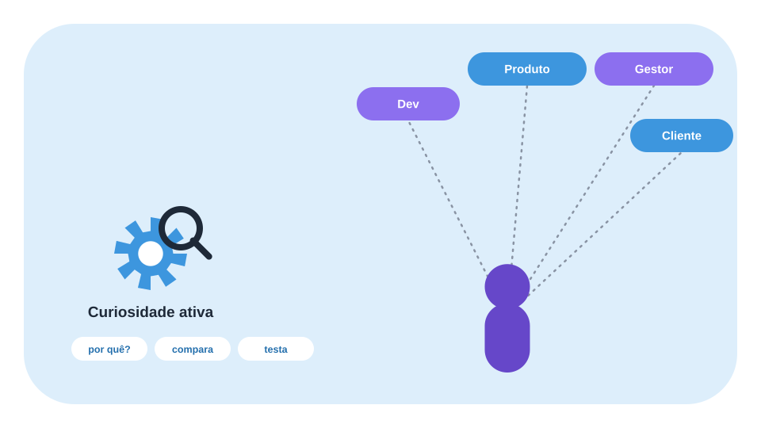

## Seção 3: O iceberg da aprendizagem

A metáfora do iceberg ajuda a separar aquilo que aparece durante o estudo daquilo que sustenta o processo.

Na parte visível estão as técnicas:

- resumos;
- mapas mentais;
- flashcards;
- revisão;
- repetição espaçada;
- recuperação ativa.

Abaixo da superfície estão fatores menos visíveis:

- atenção;
- motivação;
- curiosidade;
- conhecimento prévio;
- hábitos;
- sono;
- organização;
- compreensão;
- prática consistente.

A metáfora não é um modelo neurológico comprovado. Ela é uma maneira didática de lembrar que nenhuma técnica funciona isoladamente.

Um aplicativo de flashcards não substitui a compreensão. Um mapa conceitual não substitui a prática. Uma rotina perfeita não compensa estudar sem atenção.

A técnica é uma ferramenta. O resultado depende de como ela é usada, para qual objetivo e em quais condições.

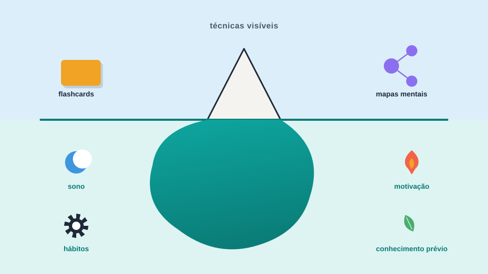

## Seção 4: Consumo e digestão: duas etapas diferentes

Justin Sung apresenta uma distinção útil entre **consumption** e **digestion**.

## Consumo

Consumo é entrar em contato com a informação:

- ler um capítulo;
- assistir a uma aula;
- ouvir um audiolivro;
- consultar documentação;
- acompanhar um tutorial;
- ler um artigo.

O consumo é necessário, mas não suficiente.

## Digestão

Digestão é transformar a informação em uma estrutura que possa ser recuperada e utilizada. Ela pode envolver:

- conectar ideias;
- explicar com suas palavras;
- comparar conceitos;
- resolver problemas;
- praticar;
- recuperar a informação sem consultar;
- organizar relações entre conceitos.

Imagine alguém assistindo a um tutorial sobre APIs REST.

Durante o consumo, a pessoa vê endpoints, métodos HTTP e códigos de status.

Durante a digestão, ela:

- fecha o tutorial;
- explica a diferença entre `GET` e `POST`;
- cria uma API pequena;
- testa respostas `200`, `400` e `404`;
- documenta o que aprendeu;
- tenta resolver um problema sem copiar o exemplo.

O aprendizado se torna mais completo quando a informação deixa de ser apenas algo visto e passa a ser algo que pode ser utilizado.

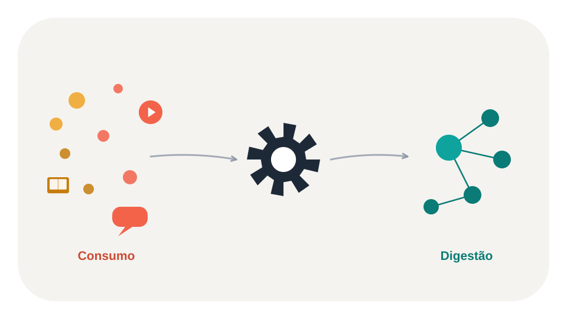

## Seção 5: O que a ciência diz sobre estudar melhor

A ciência da aprendizagem não oferece uma única técnica que seja superior em todas as situações. Ela mostra que diferentes estratégias têm efeitos diferentes, dependendo da tarefa, do conteúdo e do momento da aprendizagem.

Duas estratégias aparecem com frequência na literatura: **recuperação ativa** e **prática distribuída**, também conhecida como repetição espaçada.

## Recuperação ativa

Recuperação ativa é tentar lembrar uma informação sem consultar a fonte.

Exemplos:

- responder uma pergunta de memória;
- explicar um conceito em voz alta;
- escrever um resumo sem olhar o material;
- resolver uma questão;
- implementar uma função sem copiar;
- reconstruir um diagrama.

Ela é diferente de simplesmente reler. Na releitura, a informação está diante de você. Na recuperação, você precisa procurá-la na memória.

Essa diferença importa porque o ato de recuperar pode fortalecer a capacidade de recuperar novamente no futuro.

Um exemplo simples:

**Releitura:** "`async` permite declarar uma função assíncrona."

**Recuperação ativa:** "Explique, sem consultar, o que muda quando uma função é marcada como `async`, como `await` funciona e qual é a relação com Promises."

A segunda atividade exige mais esforço e revela melhor o que realmente foi aprendido.

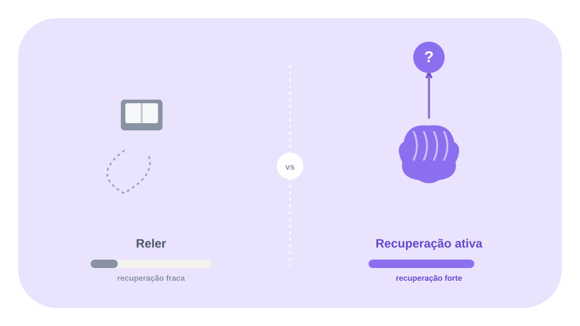

## Repetição espaçada

Repetição espaçada é distribuir as sessões de estudo ao longo do tempo, em vez de concentrar todas as revisões em um único bloco.

Por exemplo:

- Dia 1: aprender o conceito;
- Dia 2: recuperar o conceito;
- Dia 4: resolver um exercício;
- Dia 7: revisar os pontos difíceis;
- Dia 14: aplicar em um projeto.

O espaçamento cria oportunidades para recuperar o conhecimento depois de algum tempo, em vez de depender apenas da memória fresca do final da aula.

Isso não significa que exista um calendário universal. O intervalo ideal depende de fatores como dificuldade, importância, conhecimento prévio e desempenho nas revisões.

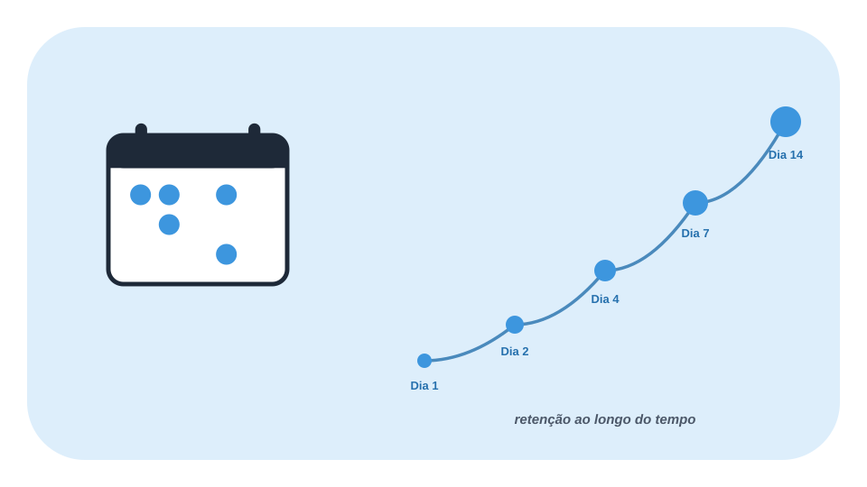

## Descanso e consolidação

O descanso também merece atenção. Depois de uma sessão intensa, continuar consumindo vídeos, notificações e novos conteúdos pode manter a mente ocupada sem necessariamente ajudar a organizar o que acabou de ser estudado.

Uma pausa de baixa demanda — caminhar, arrumar o ambiente ou realizar uma tarefa doméstica simples — pode ser uma opção útil para interromper o fluxo de estímulos.

É importante, porém, evitar uma conclusão exagerada: não há motivo para tratar "10 ou 15 minutos" como uma regra universal para todas as pessoas e tarefas. O efeito de pausas depende do contexto e do tipo de memória analisado.

Também é útil diferenciar:

- **memória declarativa:** fatos, conceitos, nomes e acontecimentos;
- **memória procedimental:** habilidades e procedimentos, como executar uma técnica ou realizar uma sequência de ações.

A pausa pode fazer parte de uma rotina de estudo, mas não substitui a prática necessária para aprender habilidades.

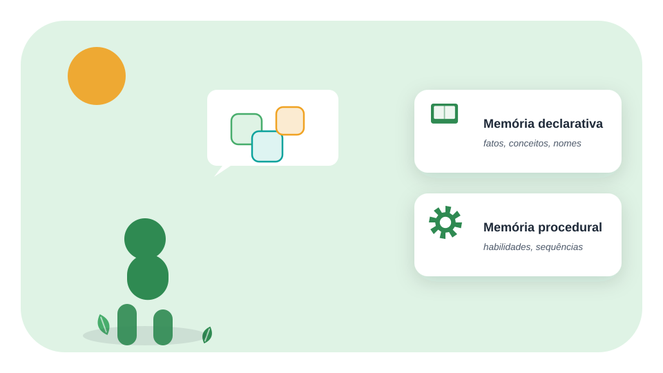

## Técnicas populares não são automaticamente eficazes

Algumas estratégias podem ajudar, mas precisam ser utilizadas de forma adequada.

- **Reler várias vezes:** pode aumentar a familiaridade sem garantir recuperação independente.
- **Destacar textos:** pode ser útil para localizar informações, mas destacar tudo não exige muita elaboração.
- **Fazer resumos:** pode ajudar, especialmente quando exige reorganização e explicação, mas não deve substituir a prática.
- **Recuperação ativa:** é útil para testar e fortalecer a recuperação, principalmente com feedback.
- **Repetição espaçada:** ajuda a distribuir as oportunidades de aprendizagem, mas não substitui compreensão e aplicação.

A revisão de Dunlosky e colaboradores é uma referência importante para discutir por que algumas técnicas têm suporte mais consistente do que outras.

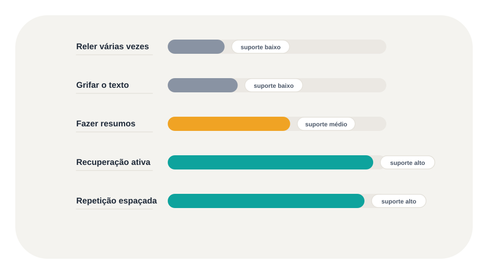

## Seção 6: O método PACER

Justin Sung propõe o método PACER como uma forma de classificar informações e escolher uma estratégia de digestão adequada.

A ideia central é simples:

*Nem toda informação deve ser estudada da mesma maneira.*

Uma instrução de programação, uma teoria, um dado estatístico e um nome isolado têm funções diferentes. Se tratarmos todos como se fossem iguais, podemos estudar de forma ineficiente.

- **P — Procedural:** prática imediata.
- **A — Analogous:** crítica da analogia.
- **C — Conceptual:** mapeamento conceitual.
- **E — Evidence:** armazenar e ensaiar.
- **R — Reference:** recuperação ativa e repetição espaçada.

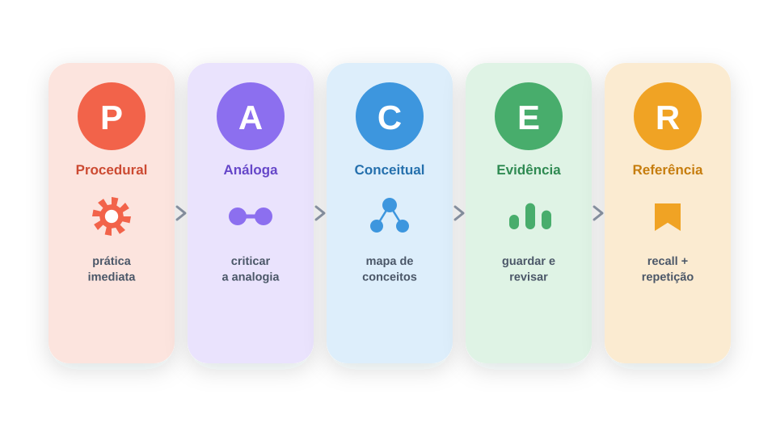

## P — Procedural

Conhecimento procedimental ensina a executar uma tarefa.

Exemplos em tecnologia:

- criar um endpoint;
- usar Git;
- escrever uma consulta SQL;
- configurar um ambiente;
- implementar uma função;
- executar testes automatizados.

A digestão principal é a **prática imediata**.

Se você está aprendendo a usar Git, ler um resumo sobre `commit`, `branch` e `merge` pode ajudar, mas não substitui executar esses comandos em um repositório.

Um bom ciclo é:

- observar um exemplo;
- repetir com orientação;
- tentar sem copiar;
- corrigir erros;
- aplicar em um projeto próprio.

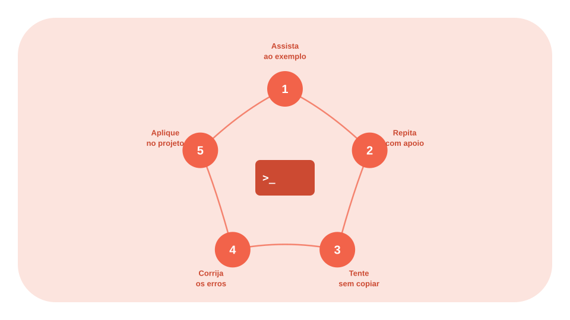

## A — Analogous

Informações analógicas são aquelas que podem ser conectadas a algo já conhecido.

Exemplos:

- comparar uma fila de mensagens com uma fila física;
- comparar cache com uma área de acesso rápido;
- relacionar um padrão de projeto a outro;
- comparar uma transação de banco de dados com uma operação que precisa ser concluída de maneira consistente.

A estratégia é **criticar a analogia**.

Pergunte:

- O que é realmente semelhante?
- O que é diferente?
- Onde a comparação deixa de funcionar?
- A analogia esclarece ou simplifica demais?

Analogias são úteis para iniciar a compreensão, mas podem gerar erros se forem tratadas como equivalências perfeitas.

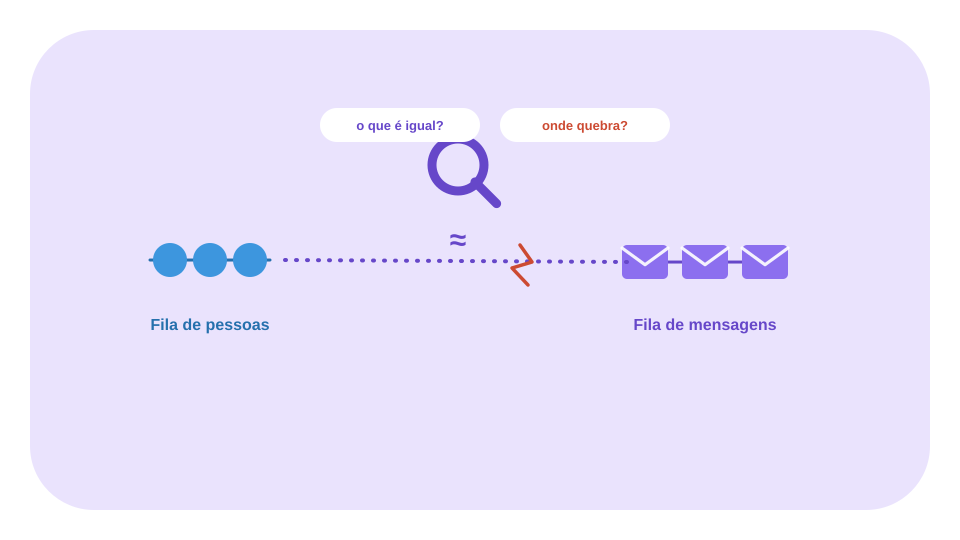

## C — Conceptual

Conhecimento conceitual envolve princípios e relações.

Exemplos:

- arquitetura de software;
- banco de dados;
- orientação a objetos;
- sistemas distribuídos;
- redes;
- concorrência;
- consistência.

A estratégia é o **mapeamento conceitual**.

Em vez de criar uma lista de definições, organize relações:

~~~text
Banco de dados
    └── Transações
          ├── Concorrência
          ├── Isolamento
          └── Consistência
~~~

O objetivo não é produzir um desenho bonito. É tornar visível a estrutura do assunto.

Um mapa útil deve responder:

- quais conceitos dependem de outros;
- quais conceitos são causas ou consequências;
- quais são exemplos;
- quais são exceções;
- como o conhecimento é aplicado.

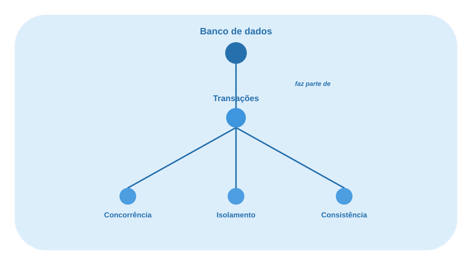

## E — Evidence

Evidências são dados, pesquisas, estatísticas e fatos que sustentam argumentos.

Em tecnologia, podem ser:

- benchmarks;
- resultados de testes;
- métricas de desempenho;
- pesquisas;
- dados de uso;
- comparações experimentais.

A estratégia é **armazenar e ensaiar**.

Ao guardar uma evidência, registre:

- o dado;
- a fonte;
- o contexto;
- o que foi medido;
- o que o dado não demonstra;
- como ele pode ser utilizado.

Isso evita que uma estatística seja retirada do contexto ou usada para sustentar uma conclusão que o estudo original não permite.

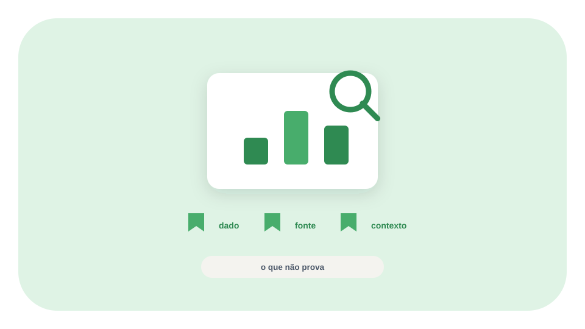

## R — Reference

Informações de referência são fatos isolados que precisam ser recuperados com precisão.

Exemplos:

- comandos Git;
- códigos HTTP;
- sintaxe;
- nomes de protocolos;
- constantes;
- atributos de uma API;
- nomes de funções.

A estratégia é usar **recuperação ativa e repetição espaçada**.

Um flashcard melhor:

*Qual código HTTP representa "Not Found" e em que situação ele costuma aparecer?*

Um flashcard pior:

*HTTP 404.*

O primeiro exige recuperar o significado e o contexto. O segundo pode virar apenas reconhecimento visual.

Flashcards são mais úteis quando são curtos, específicos e revisados com feedback.

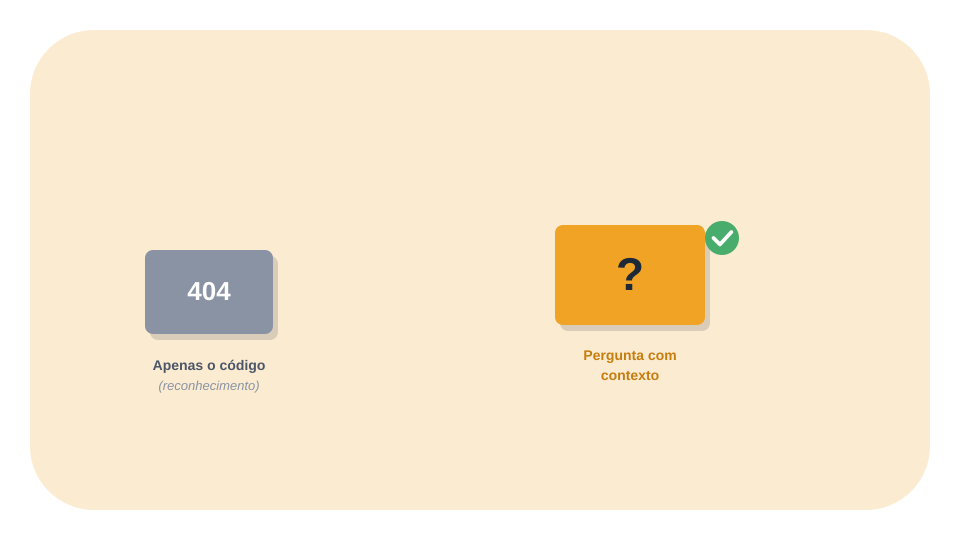

## Seção 7: Aplicando PACER à tecnologia

O método fica mais claro quando aplicado a uma tarefa real.

Imagine que você precisa aprender a construir uma API REST.

- **Criar um endpoint `GET`** (Procedural): implementar e testar.
- **Comparar REST e mensageria** (Analogous): criar e criticar a analogia.
- **Relação entre HTTP, endpoints e status** (Conceptual): construir um mapa conceitual.
- **Benchmark de duas implementações** (Evidence): guardar fonte, contexto e resultado.
- **Códigos de status HTTP** (Reference): criar flashcards e revisar.

O mesmo assunto pode conter várias categorias ao mesmo tempo. PACER não exige que um capítulo inteiro seja classificado com uma única letra. A classificação pode acontecer por trecho, conceito ou objetivo.

## Outros exemplos

**Banco de dados:** pratique consultas, conecte conceitos de transação e isolamento, mapeie relações e use flashcards para sintaxe.

**Documentação de uma biblioteca:** leia o exemplo, implemente algo, teste os limites, registre decisões e revise os nomes de funções importantes.

**Entrevista técnica:** compreenda os conceitos, pratique problemas, explique soluções em voz alta e revise fatos específicos.

**Projeto de estágio:** transforme documentação em uma pequena implementação, registre evidências de desempenho e documente decisões arquiteturais.

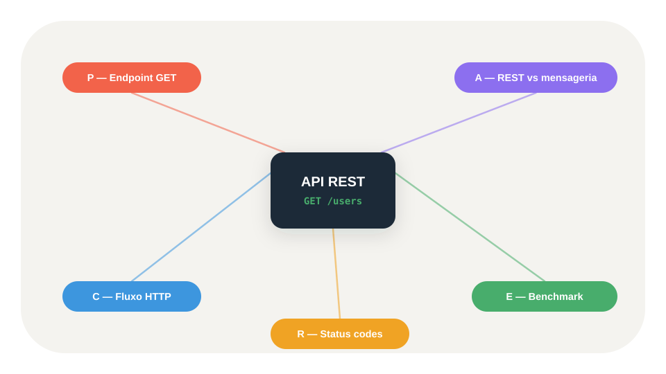

## Seção 8: Como montar um sistema de estudos

Um sistema de estudos eficiente precisa ser simples o suficiente para ser repetido.

## Etapa 1 — Defina o objetivo

Evite objetivos vagos como "estudar programação".

Prefira:

- "Implementar uma API com autenticação."
- "Entender isolamento de transações."
- "Resolver dez problemas de estruturas de dados."
- "Conseguir explicar o fluxo de uma aplicação."

## Etapa 2 — Consuma conteúdo em blocos controlados

Escolha uma fonte principal e evite abrir dez materiais ao mesmo tempo.

Durante o consumo, procure responder:

- Qual problema este conteúdo resolve?
- Quais são os conceitos principais?
- O que eu já sei sobre isso?
- O que ainda não consigo explicar?

## Etapa 3 — Classifique as informações

Use PACER para decidir o que fazer:

- Procedural → praticar;
- Analogous → comparar;
- Conceptual → mapear;
- Evidence → guardar com contexto;
- Reference → revisar com recuperação ativa.

## Etapa 4 — Faça a digestão

Não encerre a sessão apenas quando o vídeo terminar. Encerre quando você tiver produzido alguma evidência de aprendizagem:

- uma implementação;
- uma explicação;
- um mapa;
- uma resolução;
- um conjunto de flashcards;
- uma decisão documentada.

## Etapa 5 — Recupere sem consultar

Feche o material e tente reconstruir:

- o conceito;
- o processo;
- o exemplo;
- as limitações;
- a aplicação.

## Etapa 6 — Revise ao longo do tempo

Distribua revisões conforme a dificuldade e o desempenho. O que você esquece rapidamente precisa de mais oportunidades de recuperação; o que já domina pode aparecer com menos frequência.

## Etapa 7 — Aplique em um problema real

O teste final é a aplicação.

Se você estudou uma tecnologia, construa algo. Se estudou arquitetura, justifique uma decisão. Se estudou banco de dados, escreva consultas e analise resultados.

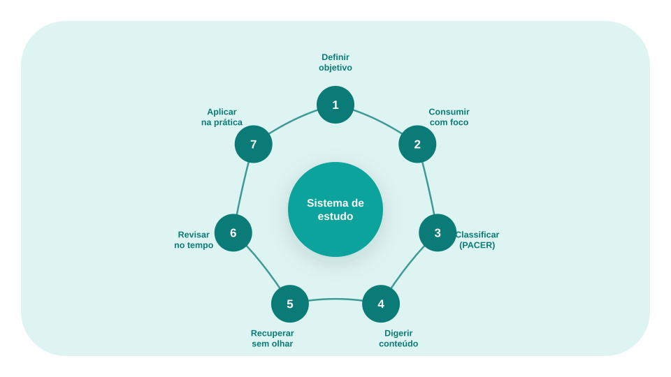

## Seção 9: Limitações e cuidados

O PACER é uma estrutura prática apresentada por Justin Sung, não um protocolo científico universalmente validado.

Também é importante evitar algumas conclusões exageradas:

- não existe uma técnica que seja melhor para absolutamente tudo;
- recuperação ativa não substitui compreensão;
- repetição espaçada não substitui prática;
- flashcards não são ideais para todo tipo de conhecimento;
- uma pausa de duração fixa não funciona necessariamente para todos;
- memorizar fatos não é o mesmo que dominar uma habilidade;
- uma sensação de fluidez durante a leitura não prova retenção de longo prazo.

O valor do método está em ajudar o estudante a perguntar:

*Que tipo de informação estou estudando e qual atividade realmente transforma essa informação em conhecimento utilizável?*

## Seção 10: Conclusão: aprender para aplicar

Os dois vídeos apresentam uma ideia que merece ser levada para além da preparação para provas: aprender é mais do que consumir conteúdo.

A ciência da aprendizagem oferece princípios importantes:

- recuperar informações fortalece a capacidade de recuperá-las;
- distribuir sessões pode melhorar a retenção;
- prática e feedback são essenciais para habilidades;
- compreensão exige relações entre conceitos;
- descanso e atenção fazem parte do contexto do estudo;
- diferentes tarefas pedem diferentes estratégias.

O método PACER acrescenta uma camada prática: classificar a informação antes de decidir como estudá-la.

Para quem trabalha ou estuda tecnologia, isso pode significar trocar uma rotina baseada apenas em vídeos e documentação por um ciclo mais completo:

**Definir → consumir → digerir → recuperar → revisar → aplicar.**

O objetivo não é lembrar tudo o que você lê. É construir conhecimento suficiente para pensar melhor, resolver problemas e agir com mais autonomia.

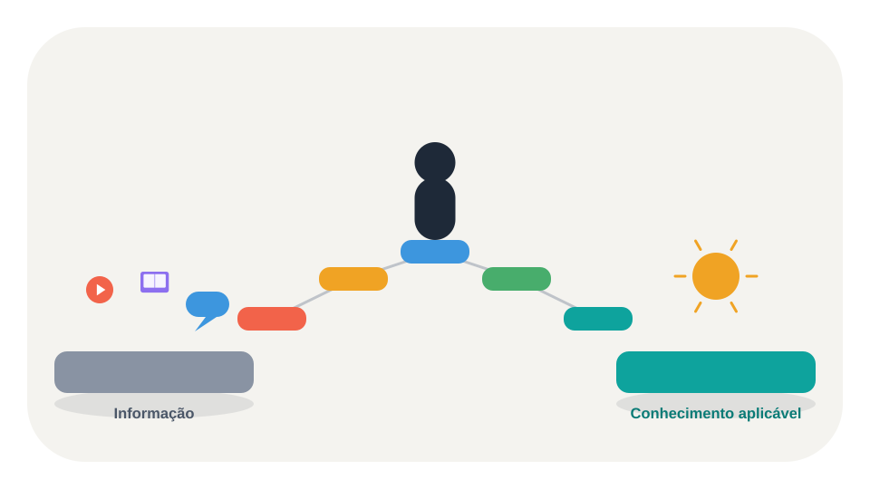

## Referências

**Vídeos:**

- Como estudar melhor — Eslen Delanogare (https://www.youtube.com/watch?v=Z4uH0JQcxas)
- How to Remember Everything You Read — Justin Sung (https://www.youtube.com/watch?v=okHkUIW46ks)

**Artigos científicos:**

- Dunlosky, J. et al. (2013). Improving Students' Learning With Effective Learning Techniques. *Psychological Science in the Public Interest* (https://doi.org/10.1177/1529100612453266).
- Karpicke, J. D.; Roediger, H. L. (2008). The Critical Importance of Retrieval for Learning. *Science* (https://doi.org/10.1111/j.1467-9280.2008.02263.x).
- Cepeda, N. J. et al. (2006). Distributed Practice in Verbal Recall Tasks: A Review and Quantitative Synthesis. *Psychological Bulletin* (https://doi.org/10.1037/0033-2909.132.3.354).
- Carpenter, S. K.; Pan, S. C.; Butler, A. C. (2022). The Science of Effective Learning With Spacing and Retrieval Practice. *Nature Reviews Psychology* (https://doi.org/10.1038/s44159-022-00089-1).
- Karpicke, J. D.; Smith, M. A. (2012). Separate Mnemonic Effects of Retrieval Practice and Elaborative Encoding. *Journal of Memory and Language* (https://doi.org/10.1016/j.jml.2011.10.004).

**Livros:**

- Brown, P. C.; Roediger III, H. L.; McDaniel, M. A. *Make It Stick: The Science of Successful Learning*. Harvard University Press, 2014.
- Willingham, D. T. *Why Don't Students Like School?* Jossey-Bass, 2009.
- Waitzkin, J. *The Art of Learning: An Inner Journey into the Pursuit of Excellence*. Free Press, 2007.
