*Studying better isn't about consuming more information. It's about turning information into knowledge you can understand, remember, and apply.*

We live in a time when learning looks easy: there are courses, videos, books, documentation, scientific papers, communities, and AI tools for practically any subject. The problem is that **access to information isn't the same as learning**.

It's possible to spend hours watching programming tutorials, save dozens of articles, and end the day unable to build anything on your own. It's also possible to reread the same material several times and feel it's familiar, only to freeze when asked to explain it without the source in front of you.

This article draws on two videos — *Como estudar melhor* ("How to Study Better"), by Eslen Delanogare, and *How to Remember Everything You Read*, by Justin Sung — to discuss what the science of learning can teach us about memory, comprehension, practice, and retention. The goal isn't to offer a miracle technique, but to build a study system that makes sense for students and tech professionals.

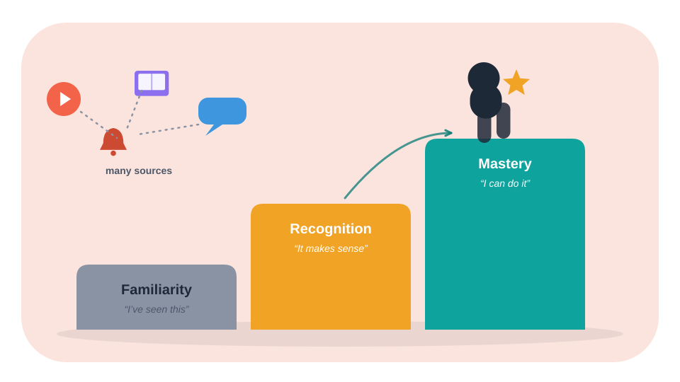

## Section 1: The problem of studying in a world full of information

The first modern challenge isn't finding content. It's selecting, processing, and turning content into competence.

A software engineering student can learn a language through:

- videos;
- courses;
- official documentation;
- posts;
- forums;
- articles;
- code examples;
- other people's projects;
- AI tools.

All of that can be useful. But when studying is reduced to consuming sources, a student can confuse three different things:

- **Familiarity:** "I've seen this before."
- **Recognition:** "When I read it, it makes sense."
- **Mastery:** "I can explain, retrieve, and apply it without depending on the source."

The difference between these three experiences matters. Familiarity can create a false sense of progress; mastery requires knowledge that is retrievable and usable.

So the most important question isn't "how many hours did I study?" or "how many videos did I watch?", but:

*What can I do now that I couldn't do before?*

## Section 2: Continuous learning and professional development

In the tech job market, continuous learning matters because tools, languages, architectures, and practices keep changing. Knowledge that was enough to solve a problem yesterday might not be enough for the next project.

That doesn't mean degrees, certifications, or courses lost their value. It means they need to be paired with practical ability, reasoning, and communication.

## Active curiosity

Active curiosity is more than liking interesting subjects. It shows up when a student:

- asks why a solution works;
- investigates the causes of an error;
- compares alternatives;
- checks the documentation;
- tests hypotheses;
- tries to explain the subject in their own words.

In programming, for instance, it isn't enough to memorize that a SQL query uses `JOIN`. What matters more is understanding when to use each type of `JOIN`, which records will be returned, and how performance can change.

## Communication is also part of learning

Being able to explain an idea is a way of testing whether it was actually understood.

A professional may need to explain the same problem to different audiences:

- a fellow developer;
- a product person;
- a manager;
- a client;
- someone with no technical background.

Communication requires mental organization. If you can't explain a problem simply, you may still be working with familiar words rather than a well-organized structure of knowledge.

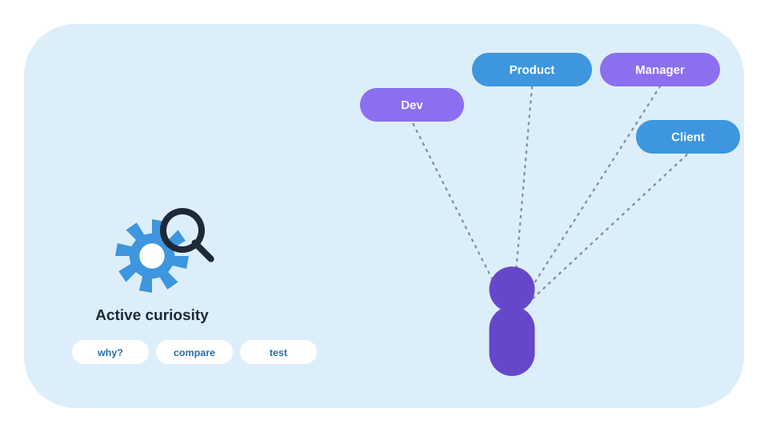

## Section 3: The learning iceberg

The iceberg metaphor helps separate what's visible during study from what sustains the process.

Above the surface are the techniques:

- summaries;
- mind maps;
- flashcards;
- review;
- spaced repetition;
- active recall.

Below the surface are less visible factors:

- attention;
- motivation;
- curiosity;
- prior knowledge;
- habits;
- sleep;
- organization;
- comprehension;
- consistent practice.

The metaphor isn't a proven neurological model. It's a didactic way to remember that no technique works in isolation.

A flashcard app doesn't replace comprehension. A concept map doesn't replace practice. A perfect routine doesn't make up for studying without attention.

The technique is a tool. The result depends on how it's used, for which goal, and under which conditions.

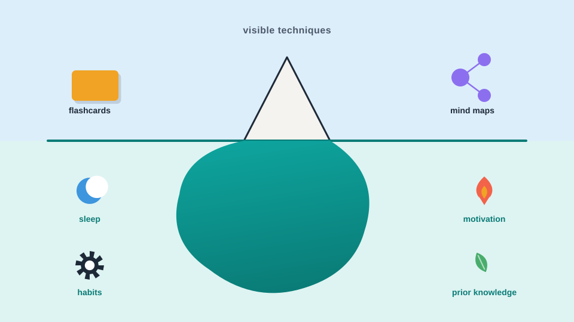

## Section 4: Consumption and digestion: two different stages

Justin Sung draws a useful distinction between **consumption** and **digestion**.

## Consumption

Consumption is coming into contact with information:

- reading a chapter;
- watching a lecture;
- listening to an audiobook;
- checking documentation;
- following a tutorial;
- reading an article.

Consumption is necessary, but not sufficient.

## Digestion

Digestion is turning information into a structure that can be retrieved and used. It can involve:

- connecting ideas;
- explaining in your own words;
- comparing concepts;
- solving problems;
- practicing;
- retrieving information without consulting;
- organizing relationships between concepts.

Imagine someone watching a tutorial on REST APIs.

During consumption, the person sees endpoints, HTTP methods, and status codes.

During digestion, they:

- close the tutorial;
- explain the difference between `GET` and `POST`;
- build a small API;
- test `200`, `400`, and `404` responses;
- document what they learned;
- try to solve a problem without copying the example.

Learning becomes more complete when information stops being just something seen and becomes something that can be used.

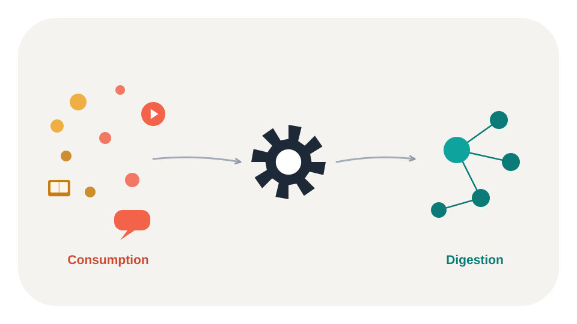

## Section 5: What science says about studying better

The science of learning doesn't offer a single technique that's superior in every situation. It shows that different strategies have different effects, depending on the task, the content, and the moment of learning.

Two strategies show up often in the literature: **active recall** and **distributed practice**, also known as spaced repetition.

## Active recall

Active recall is trying to remember information without checking the source.

Examples:

- answering a question from memory;
- explaining a concept out loud;
- writing a summary without looking at the material;
- solving a problem;
- implementing a function without copying;
- reconstructing a diagram.

It's different from simply rereading. In rereading, the information is right in front of you. In recall, you have to search for it in memory.

That difference matters because the act of retrieving can strengthen the ability to retrieve it again in the future.

A simple example:

**Rereading:** "`async` lets you declare an asynchronous function."

**Active recall:** "Explain, without checking, what changes when a function is marked `async`, how `await` works, and how it relates to Promises."

The second activity demands more effort and reveals more clearly what was actually learned.

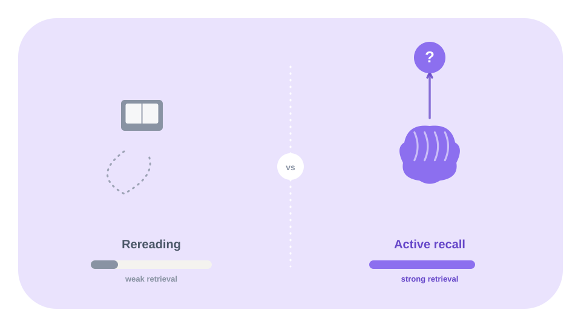

## Spaced repetition

Spaced repetition means spreading study sessions out over time, instead of concentrating all review into a single block.

For example:

- Day 1: learn the concept;
- Day 2: retrieve the concept;
- Day 4: solve an exercise;
- Day 7: review the hard points;
- Day 14: apply it in a project.

Spacing creates opportunities to retrieve knowledge after some time has passed, instead of relying only on the fresh memory from the end of class.

That doesn't mean there's a universal schedule. The ideal interval depends on factors like difficulty, importance, prior knowledge, and performance on reviews.

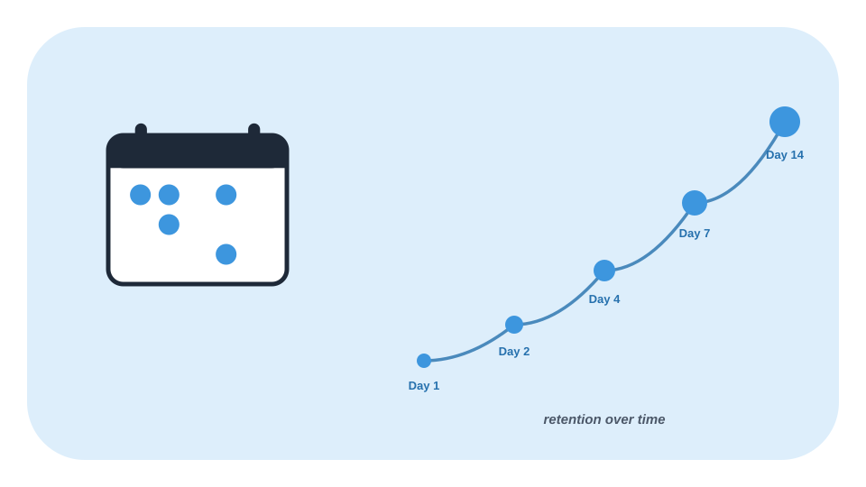

## Rest and consolidation

Rest also deserves attention. After an intense session, continuing to consume videos, notifications, and new content can keep the mind busy without necessarily helping it organize what was just studied.

A low-demand break — going for a walk, tidying up the room, or doing a simple household task — can be a useful way to interrupt the flow of stimuli.

It's important, however, to avoid an exaggerated conclusion: there's no reason to treat "10 or 15 minutes" as a universal rule for every person and every task. The effect of breaks depends on the context and the type of memory involved.

It also helps to distinguish:

- **declarative memory:** facts, concepts, names, and events;
- **procedural memory:** skills and procedures, such as performing a technique or a sequence of actions.

A break can be part of a study routine, but it doesn't replace the practice needed to learn skills.

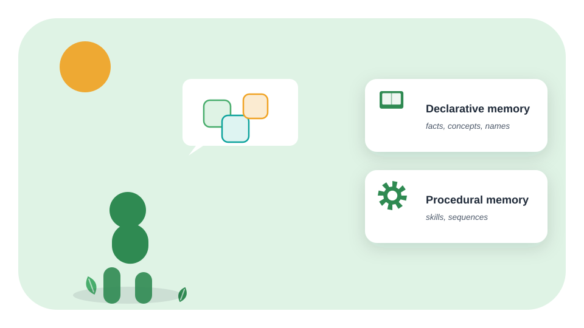

## Popular techniques aren't automatically effective

Some strategies can help, but they need to be used the right way.

- **Rereading multiple times:** can increase familiarity without guaranteeing independent recall.
- **Highlighting text:** can be useful for locating information, but highlighting everything doesn't require much elaboration.
- **Writing summaries:** can help, especially when it requires reorganizing and explaining, but it shouldn't replace practice.
- **Active recall:** useful for testing and strengthening retrieval, especially with feedback.
- **Spaced repetition:** helps distribute learning opportunities, but doesn't replace comprehension and application.

Dunlosky and colleagues' review is an important reference for discussing why some techniques have more consistent support than others.

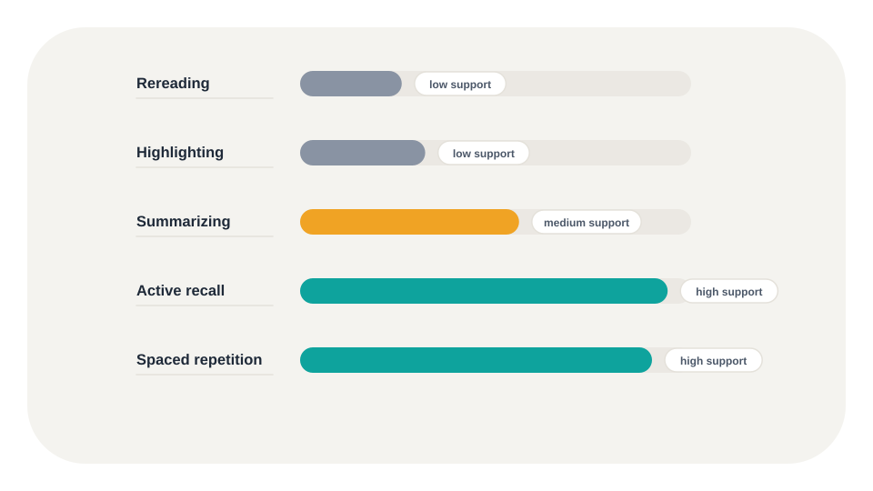

## Section 6: The PACER method

Justin Sung proposes the PACER method as a way to classify information and choose an appropriate digestion strategy.

The core idea is simple:

*Not all information should be studied the same way.*

A programming instruction, a theory, a statistic, and an isolated name serve different functions. Treating them all the same way leads to inefficient studying.

- **P — Procedural:** immediate practice.
- **A — Analogous:** critique the analogy.
- **C — Conceptual:** concept mapping.
- **E — Evidence:** store and rehearse.
- **R — Reference:** active recall and spaced repetition.

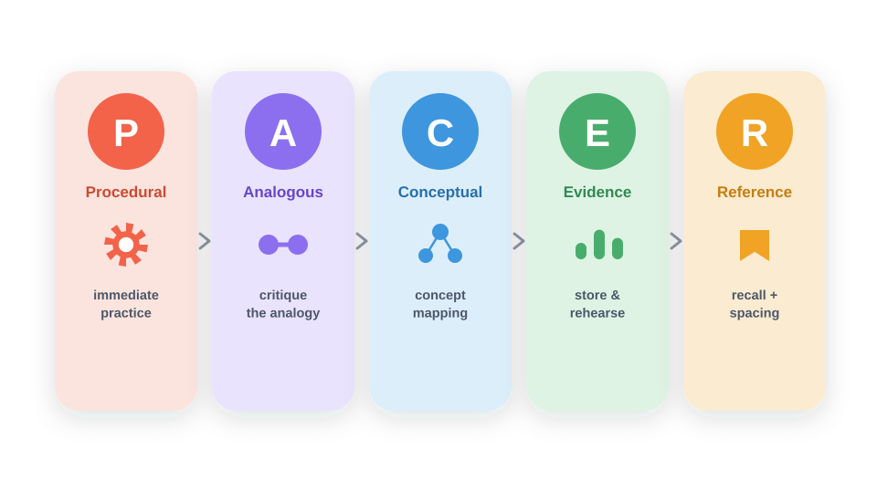

## P — Procedural

Procedural knowledge teaches you how to perform a task.

Examples in tech:

- creating an endpoint;
- using Git;
- writing a SQL query;
- setting up an environment;
- implementing a function;
- running automated tests.

The main digestion strategy is **immediate practice**.

If you're learning Git, reading a summary of `commit`, `branch`, and `merge` can help, but it doesn't replace actually running those commands in a repository.

A good cycle is:

- watch an example;
- repeat it with guidance;
- try it without copying;
- fix mistakes;
- apply it in your own project.

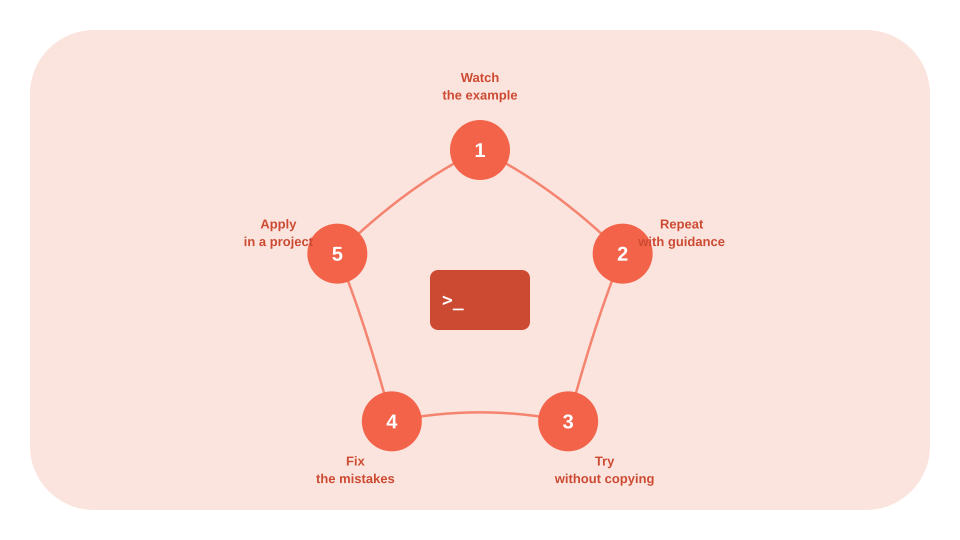

## A — Analogous

Analogous information is information that can be connected to something already known.

Examples:

- comparing a message queue to a physical line;
- comparing a cache to a fast-access shelf;
- relating one design pattern to another;
- comparing a database transaction to an operation that needs to be completed consistently.

The strategy is to **critique the analogy**.

Ask:

- What is actually similar?
- What is different?
- Where does the comparison break down?
- Does the analogy clarify things or oversimplify them?

Analogies are useful for kickstarting understanding, but they can produce errors if treated as perfect equivalences.

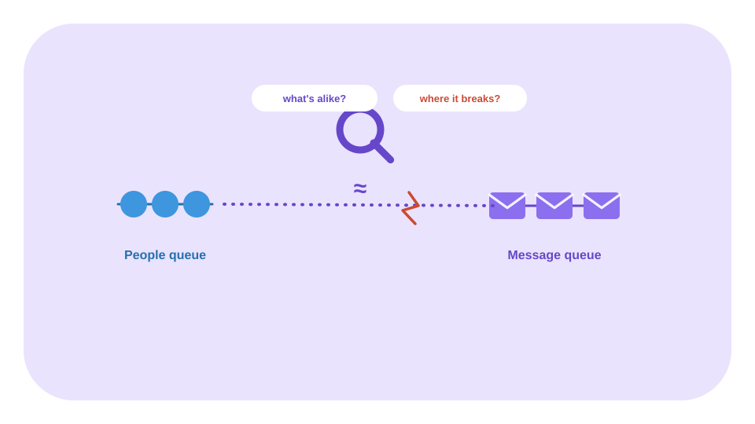

## C — Conceptual

Conceptual knowledge involves principles and relationships.

Examples:

- software architecture;
- databases;
- object orientation;
- distributed systems;
- networks;
- concurrency;
- consistency.

The strategy is **concept mapping**.

Instead of building a list of definitions, organize relationships:

~~~text
Database
    └── Transactions
          ├── Concurrency
          ├── Isolation
          └── Consistency
~~~

The goal isn't to produce a pretty drawing. It's to make the structure of the subject visible.

A useful map should answer:

- which concepts depend on others;
- which concepts are causes or consequences;
- which are examples;
- which are exceptions;
- how the knowledge is applied.

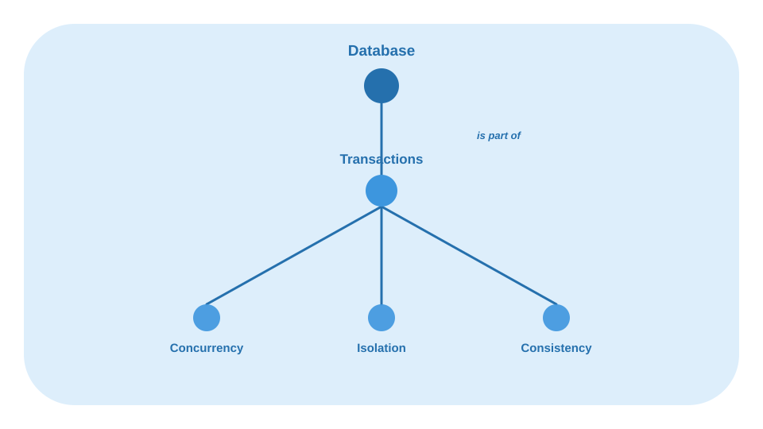

## E — Evidence

Evidence is data, research, statistics, and facts that support arguments.

In tech, it can be:

- benchmarks;
- test results;
- performance metrics;
- research;
- usage data;
- experimental comparisons.

The strategy is to **store and rehearse**.

When you save a piece of evidence, record:

- the data;
- the source;
- the context;
- what was measured;
- what the data doesn't prove;
- how it can be used.

This prevents a statistic from being taken out of context or used to support a conclusion the original study doesn't actually allow.

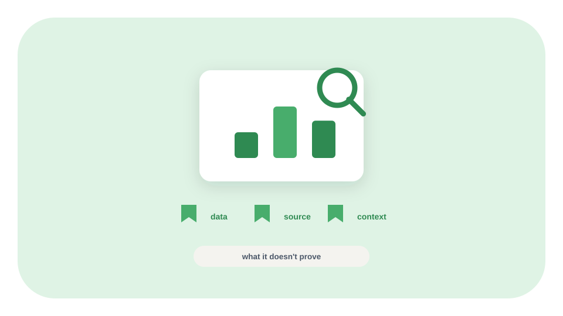

## R — Reference

Reference information is isolated facts that need to be retrieved precisely.

Examples:

- Git commands;
- HTTP status codes;
- syntax;
- protocol names;
- constants;
- API attributes;
- function names.

The strategy is to use **active recall and spaced repetition**.

A better flashcard:

*Which HTTP status code represents "Not Found," and in what situation does it usually show up?*

A worse flashcard:

*HTTP 404.*

The first requires retrieving the meaning and the context. The second can turn into mere visual recognition.

Flashcards are most useful when they're short, specific, and reviewed with feedback.

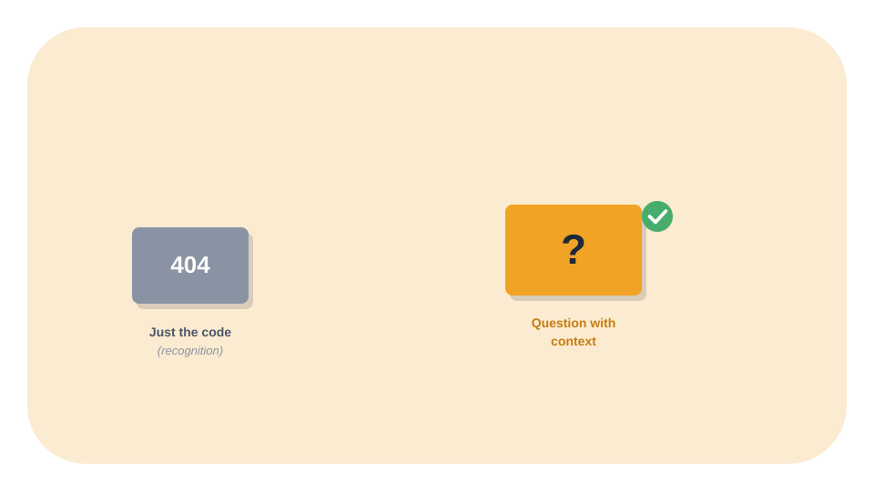

## Section 7: Applying PACER to technology

The method becomes clearer when applied to a real task.

Imagine you need to learn how to build a REST API.

- **Creating a `GET` endpoint** (Procedural): implement and test it.
- **Comparing REST and messaging** (Analogous): build and critique the analogy.
- **The relationship between HTTP, endpoints, and status codes** (Conceptual): build a concept map.
- **A benchmark of two implementations** (Evidence): store the source, context, and result.
- **HTTP status codes** (Reference): make flashcards and review them.

The same subject can contain multiple categories at once. PACER doesn't require an entire chapter to be classified under a single letter. Classification can happen by passage, concept, or goal.

## Other examples

**Databases:** practice queries, connect the concepts of transactions and isolation, map relationships, and use flashcards for syntax.

**A library's documentation:** read the example, implement something, test the limits, record decisions, and review the important function names.

**Technical interviews:** understand the concepts, practice problems, explain solutions out loud, and review specific facts.

**An internship project:** turn documentation into a small implementation, record performance evidence, and document architectural decisions.

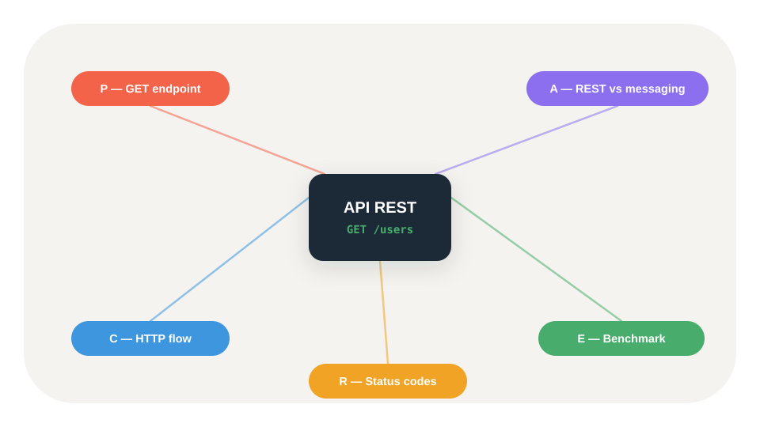

## Section 8: Building a study system

An effective study system needs to be simple enough to repeat.

## Step 1 — Define the goal

Avoid vague goals like "study programming."

Prefer:

- "Implement an API with authentication."
- "Understand transaction isolation."
- "Solve ten data structure problems."
- "Be able to explain an application's flow."

## Step 2 — Consume content in controlled blocks

Pick one main source and avoid opening ten materials at once.

While consuming, try to answer:

- What problem does this content solve?
- What are the main concepts?
- What do I already know about this?
- What can I still not explain?

## Step 3 — Classify the information

Use PACER to decide what to do:

- Procedural → practice;
- Analogous → compare;
- Conceptual → map;
- Evidence → store with context;
- Reference → review with active recall.

## Step 4 — Do the digestion

Don't end the session just because the video ended. End it when you've produced some evidence of learning:

- an implementation;
- an explanation;
- a map;
- a solved exercise;
- a set of flashcards;
- a documented decision.

## Step 5 — Retrieve without checking

Close the material and try to reconstruct:

- the concept;
- the process;
- the example;
- the limitations;
- the application.

## Step 6 — Review over time

Distribute reviews according to difficulty and performance. What you forget quickly needs more opportunities for retrieval; what you already master can show up less often.

## Step 7 — Apply it to a real problem

The final test is application.

If you studied a technology, build something. If you studied architecture, justify a decision. If you studied databases, write queries and analyze the results.

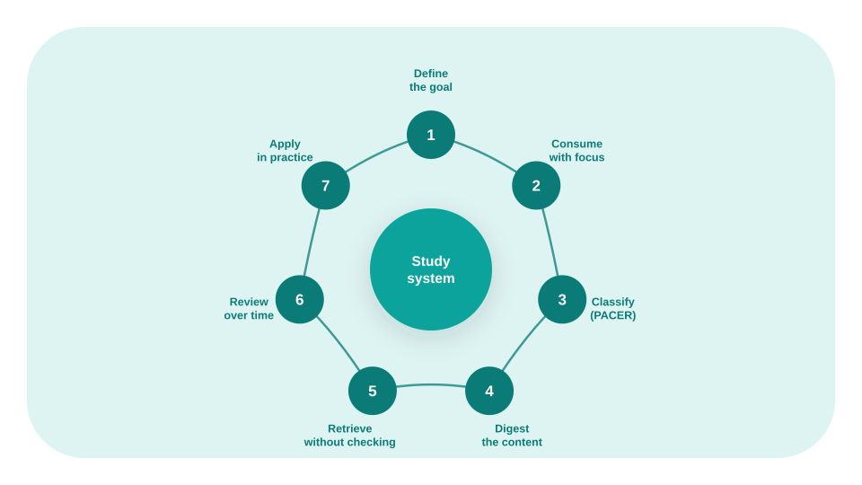

## Section 9: Limitations and caveats

PACER is a practical framework put forward by Justin Sung, not a universally validated scientific protocol.

It's also important to avoid some exaggerated conclusions:

- there's no single technique that's best for absolutely everything;
- active recall doesn't replace comprehension;
- spaced repetition doesn't replace practice;
- flashcards aren't ideal for every type of knowledge;
- a fixed-length break doesn't necessarily work for everyone;
- memorizing facts isn't the same as mastering a skill;
- a feeling of fluency while reading doesn't prove long-term retention.

The value of the method lies in helping the student ask:

*What type of information am I studying, and what activity actually turns this information into usable knowledge?*

## Section 10: Conclusion: learning in order to apply

The two videos present an idea that deserves to be carried beyond exam prep: learning is more than consuming content.

The science of learning offers important principles:

- retrieving information strengthens the ability to retrieve it again;
- spacing out sessions can improve retention;
- practice and feedback are essential for skills;
- comprehension requires relationships between concepts;
- rest and attention are part of the context of studying;
- different tasks call for different strategies.

The PACER method adds a practical layer: classifying information before deciding how to study it.

For anyone who works or studies in tech, that can mean trading a routine built only on videos and documentation for a more complete cycle:

**Define → consume → digest → retrieve → review → apply.**

The goal isn't to remember everything you read. It's to build enough knowledge to think better, solve problems, and act with more autonomy.

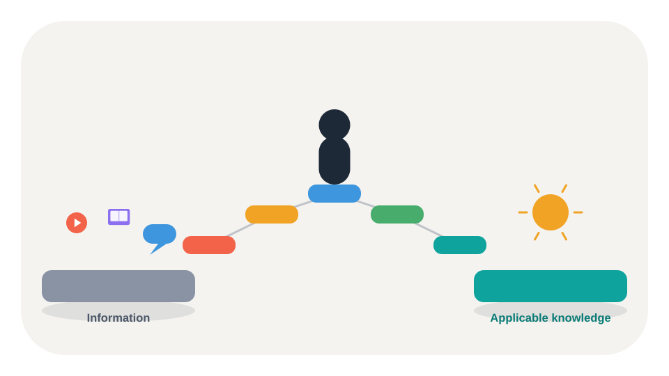

## References

**Videos:**

- Como estudar melhor ("How to Study Better") — Eslen Delanogare (https://www.youtube.com/watch?v=Z4uH0JQcxas)
- How to Remember Everything You Read — Justin Sung (https://www.youtube.com/watch?v=okHkUIW46ks)

**Scientific papers:**

- Dunlosky, J. et al. (2013). Improving Students' Learning With Effective Learning Techniques. *Psychological Science in the Public Interest* (https://doi.org/10.1177/1529100612453266).
- Karpicke, J. D.; Roediger, H. L. (2008). The Critical Importance of Retrieval for Learning. *Science* (https://doi.org/10.1111/j.1467-9280.2008.02263.x).
- Cepeda, N. J. et al. (2006). Distributed Practice in Verbal Recall Tasks: A Review and Quantitative Synthesis. *Psychological Bulletin* (https://doi.org/10.1037/0033-2909.132.3.354).
- Carpenter, S. K.; Pan, S. C.; Butler, A. C. (2022). The Science of Effective Learning With Spacing and Retrieval Practice. *Nature Reviews Psychology* (https://doi.org/10.1038/s44159-022-00089-1).
- Karpicke, J. D.; Smith, M. A. (2012). Separate Mnemonic Effects of Retrieval Practice and Elaborative Encoding. *Journal of Memory and Language* (https://doi.org/10.1016/j.jml.2011.10.004).

**Books:**

- Brown, P. C.; Roediger III, H. L.; McDaniel, M. A. *Make It Stick: The Science of Successful Learning*. Harvard University Press, 2014.
- Willingham, D. T. *Why Don't Students Like School?* Jossey-Bass, 2009.
- Waitzkin, J. *The Art of Learning: An Inner Journey into the Pursuit of Excellence*. Free Press, 2007.
