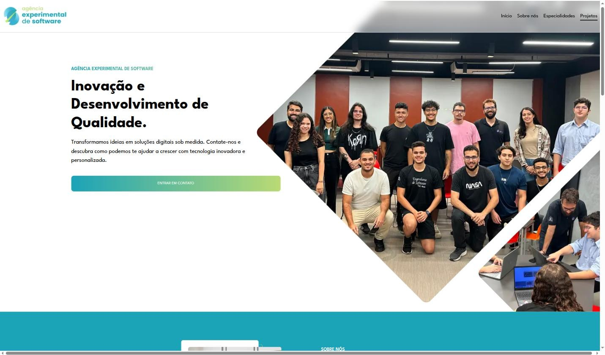
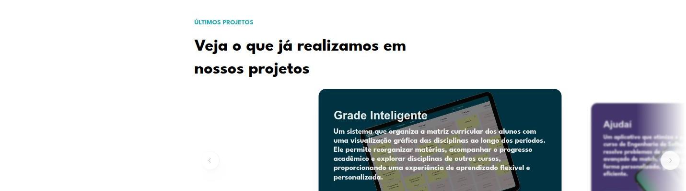

The Agência Experimental de Software (AES) is a student-run organization tied to PUC Minas' Software Engineering program, building real digital solutions for clients inside and outside the university. The institutional landing page is the entry point for that operation: it's where new demands come in, get reviewed, and get routed to the responsible team, and also where the agency lists the projects it has delivered.

## My role

I worked on the site's backend, building the Node.js and Express API with Prisma on PostgreSQL, including the automated email flow (via Nodemailer) that confirms to the client that a demand was received and, later, notifies them when it's approved as a project.

## Features

- Contact form for companies and students interested in proposing or joining a project
- Specialties page, highlighting the agency's differentiators (on-time delivery, personalization, modern stack)
- A page listing projects the agency has delivered
- FAQ segmented for two different audiences: client companies and students who want to join
- Automated email flow confirming receipt of a demand and, later, its approval as a project

## Featured projects

The project list already includes real work delivered to clients inside and outside the university, such as Grade Inteligente (visual curriculum planning) and Ajudaí (a support app for Software Engineering students), among others.

