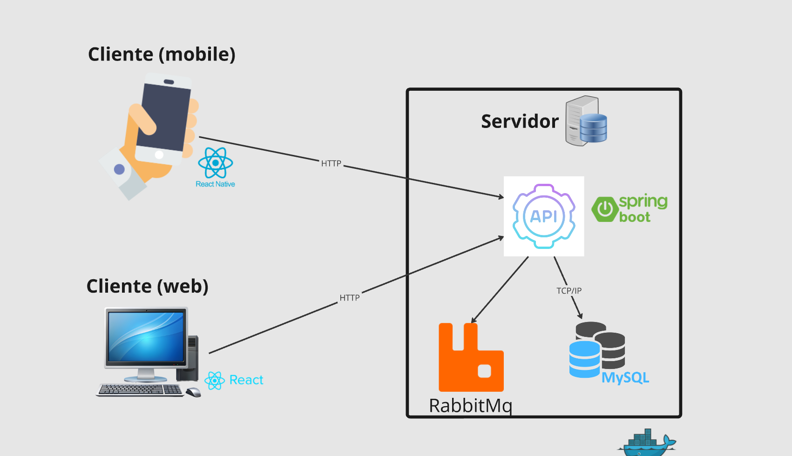
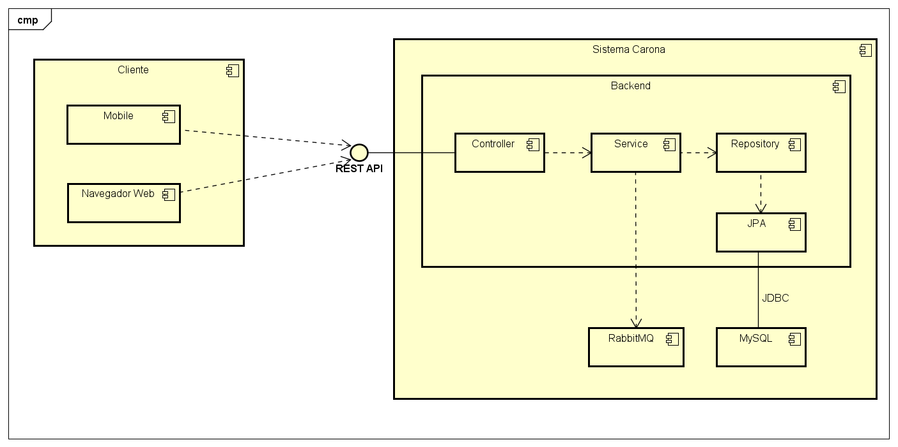
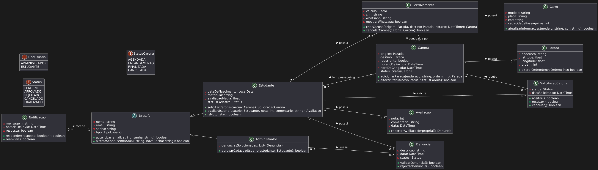
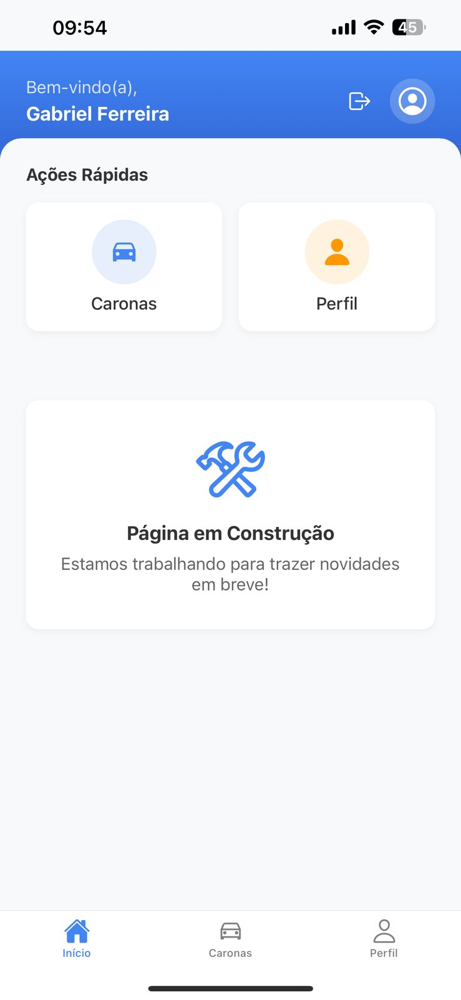
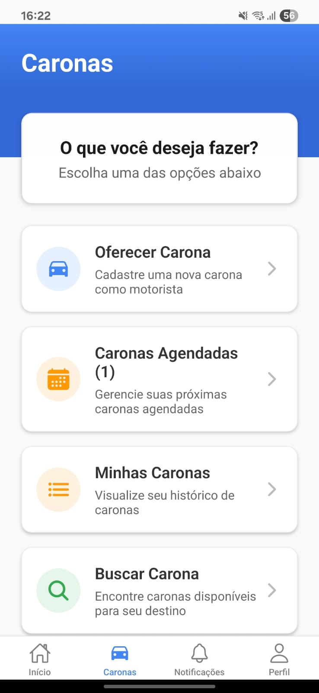
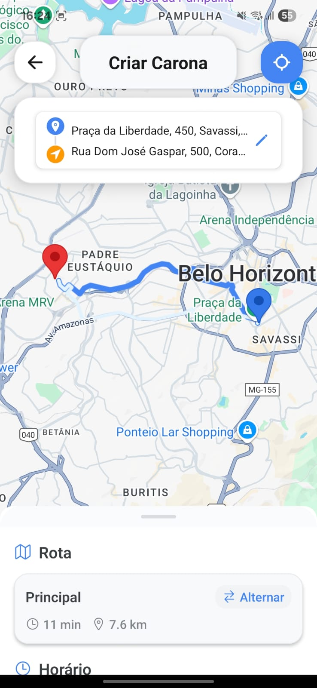

O Carona? nasceu de um problema bem concreto: a dificuldade de mobilidade fora do horário comercial, quando o transporte público é escasso e apps como Uber ficam caros ou demoram para aceitar corrida. A proposta é simples — conectar quem já vai dirigir até um destino com quem precisa ir para o mesmo lugar, sem cobrança automática e sem rastreamento ao vivo, mantendo o sistema leve e focado em organizar a combinação entre motorista e passageiro.

Fiz parte de uma equipe de 6 pessoas responsável por todo o ciclo do produto: levantamento de requisitos, modelagem, e a construção do app mobile, do backend e do painel administrativo web.

## Funcionalidades

- Cadastro e login separados para passageiros e motoristas, com aprovação de novos motoristas por um administrador
- Criação de caronas com origem, destino, horário e número de vagas, com seleção de rota em mapa via OpenStreetMap
- Busca e solicitação de caronas disponíveis, com aceite ou recusa pelo motorista
- Cancelamento de participação em caronas já confirmadas
- Avaliação mútua entre motorista e passageiro ao final da viagem
- Denúncia de usuários, com fila de revisão para administradores
- Central de notificações, incluindo alertas em tempo real sobre novas caronas e mudanças de viagem
- Histórico de viagens tanto para quem dirige quanto para quem pega carona
- Painel web administrativo para aprovar cadastros, visualizar todas as viagens da plataforma e tratar denúncias

## Arquitetura

O sistema segue uma arquitetura cliente-servidor simples e direta: dois clientes (app mobile em React Native e painel web em React) conversam por HTTP com uma API única em Java Spring Boot, que persiste os dados em MySQL e usa RabbitMQ para processar notificações de forma assíncrona — assim, o envio de um alerta não trava a resposta da API. Imagens de perfil e de veículos ficam no Supabase.

Do lado do backend, a API segue uma separação clássica em camadas — Controller, Service e Repository —, com RabbitMQ e MySQL como dependências externas do serviço.

## Modelagem

O modelo de domínio gira em torno de `Usuario`, que se especializa em `Estudante` (podendo atuar como passageiro ou também como motorista, via `PerfilMotorista`) e `Administrador`. Uma `Carona` tem `Parada`s, recebe `SolicitacaoCarona` de estudantes, gera `Avaliacao`es entre as partes e pode originar `Denuncia`s revisadas por administradores.

## Telas do aplicativo

