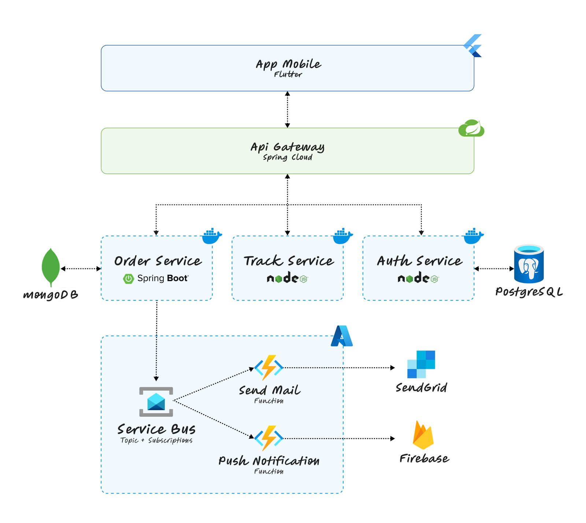
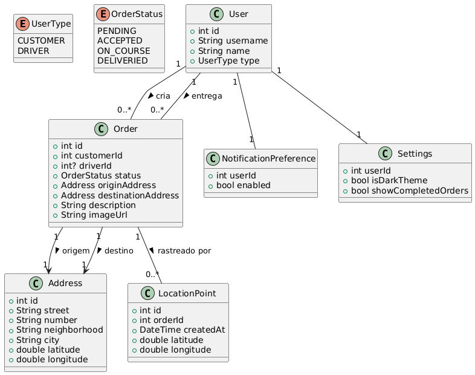

Sistema completo de gestão e rastreamento de entregas, construído em equipe de 3 pessoas, unindo um app mobile híbrido em Flutter a um backend em arquitetura de microsserviços, com uma camada serverless na Azure para picos de notificação.

## Funcionalidades

- Fluxos separados para clientes e entregadores dentro do mesmo app
- Rastreamento de entregas em tempo real via GPS
- Captura de foto como comprovante de entrega
- Histórico de pedidos e armazenamento offline com SQLite
- Notificações push e por e-mail disparadas de forma assíncrona
- Autenticação centralizada via API Gateway, com emissão de tokens JWT

## Arquitetura

Cada responsabilidade do sistema é um serviço independente, com seu próprio banco de dados:

- **API Gateway** (Spring Cloud Gateway) — ponto único de entrada, roteando e autenticando todas as chamadas
- **Auth Service** (Node.js) — autenticação e emissão de tokens JWT, com MongoDB
- **Order Service** (Java 21 / Spring Boot) — CRUD completo de pedidos, com MongoDB
- **Tracking Service** (Node.js) — rastreamento de entregas em tempo real, com PostgreSQL e documentação Swagger

Os serviços se comunicam de forma síncrona via REST e de forma assíncrona via RabbitMQ, isolando falhas e permitindo escalar cada serviço de forma independente.

Numa terceira fase, integramos Azure Functions e Azure Service Bus para processar o envio de e-mails (SendGrid) e notificações push (Firebase) de forma assíncrona e serverless, absorvendo picos de demanda sem sobrecarregar os serviços principais. Toda a orquestração é feita com Docker e Docker Compose, com health checks em todos os serviços.

## Modelagem

O domínio é centrado em `User`, `Order`, `Address` e `LocationPoint` para o rastreamento em tempo real, além de `NotificationPreference` e `Settings` para personalizar como cada usuário recebe alertas.

