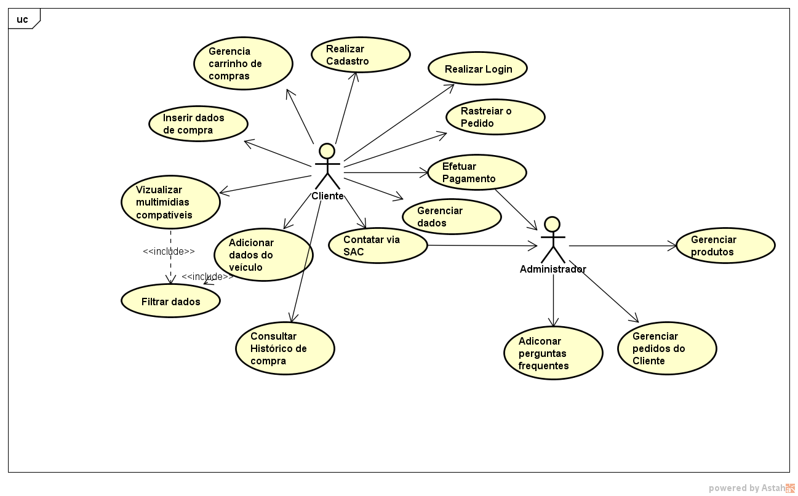
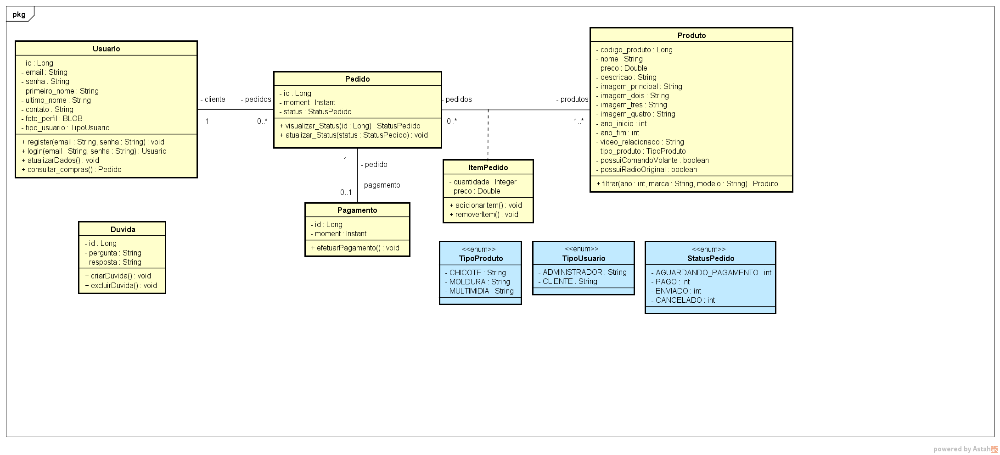
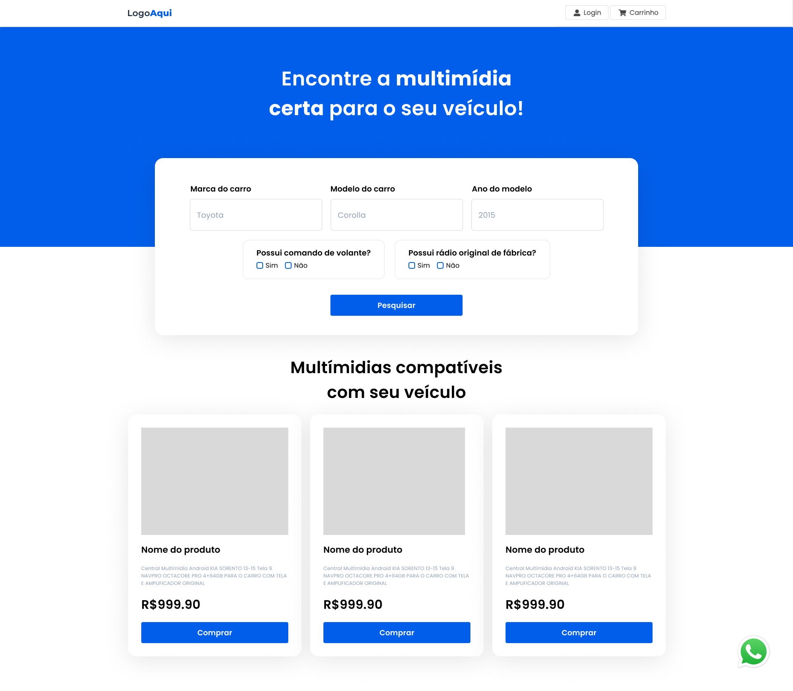

DePinho Multimídias é um e-commerce sob medida construído em equipe para um cliente real: o Gabriel De Pinho, YouTuber que vende e instala centrais multimídia automotivas. O desafio central não é só vender — é ajudar o cliente a encontrar a peça certa para o carro dele, então o produto inteiro gira em torno de uma busca por compatibilidade veicular.

## Funcionalidades

- Busca de produtos por marca, modelo e ano do veículo, com filtros adicionais para comando de volante e rádio original de fábrica
- Catálogo de multimídias compatíveis, carrinho de compras e checkout integrado ao MercadoPago
- Histórico de pedidos e rastreamento de status da compra
- Canal de dúvidas (SAC) onde o cliente pergunta e o administrador responde
- Painel administrativo para gestão de produtos, pedidos e perguntas frequentes
- Autenticação com papéis distintos para cliente e administrador

## Modelagem

O caso de uso central do sistema separa claramente as duas pontas: o Cliente busca, filtra e compra produtos compatíveis com seu veículo, enquanto o Administrador gerencia o catálogo, os pedidos e as perguntas frequentes.

O modelo de dados reflete essa busca por compatibilidade: cada `Produto` carrega `ano_inicio` e `ano_fim` de compatibilidade, além de flags para comando de volante e rádio original, associados a um `Pedido` com seus `ItemPedido` e `Pagamento`.

## Telas

