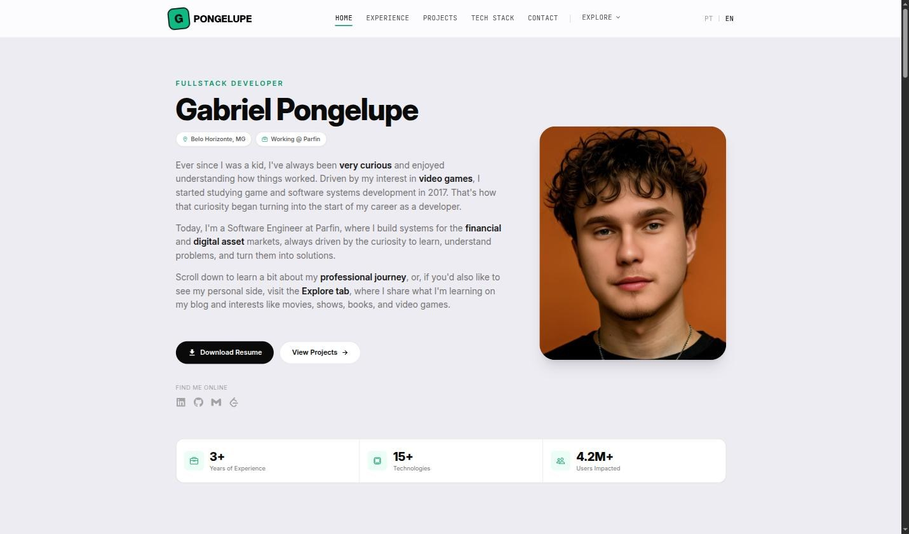
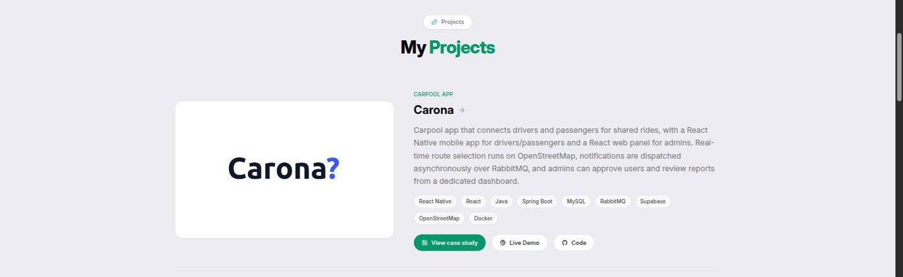

Este site é o meu portfólio pessoal. É também o maior "cliente" da minha curiosidade em produto: cada seção nova (blog, estudos de caso de projeto, seletor de idioma) foi uma desculpa para experimentar algo que eu queria aprender.

## Funcionalidades

- Conteúdo bilíngue (PT/EN) em todo o site, com troca de idioma persistida pelo contexto React
- Blog escrito em Markdown puro, versionado no próprio repositório, com parser e renderer customizados que suportam imagens, código com syntax highlight e sumário automático
- Estudos de caso de projeto (esta própria página!) usando o mesmo motor de Markdown do blog, com player de vídeo embutido para demos
- Animações de entrada e transição de página com Framer Motion
- Deploy contínuo na Vercel a cada push para a branch principal

## Como o conteúdo é organizado

Tanto os posts do blog quanto as páginas de projeto são pastas com um `post.br.md`, um `post.eng.md`, um `meta.json` opcional e uma pasta `images/`. O Vite importa tudo isso automaticamente em build time via `import.meta.glob`, então adicionar um projeto novo é só criar a pasta e escrever o Markdown, sem tocar em nenhum componente.

