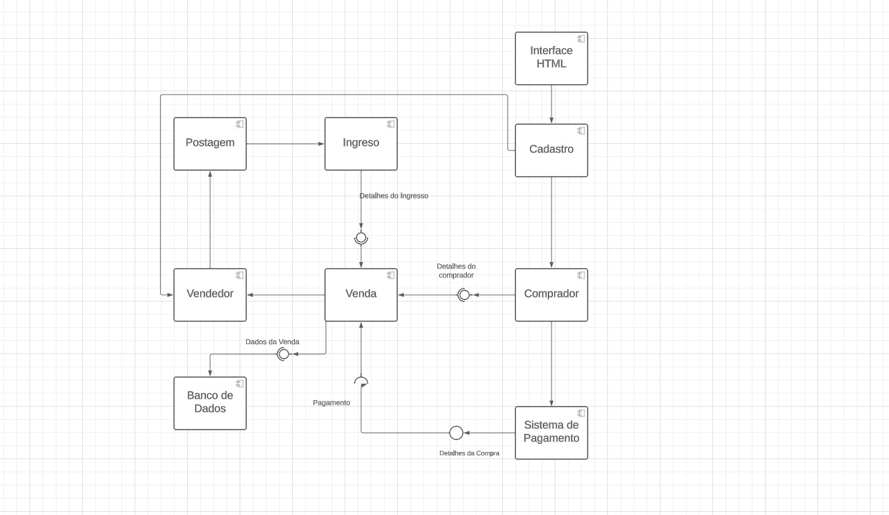
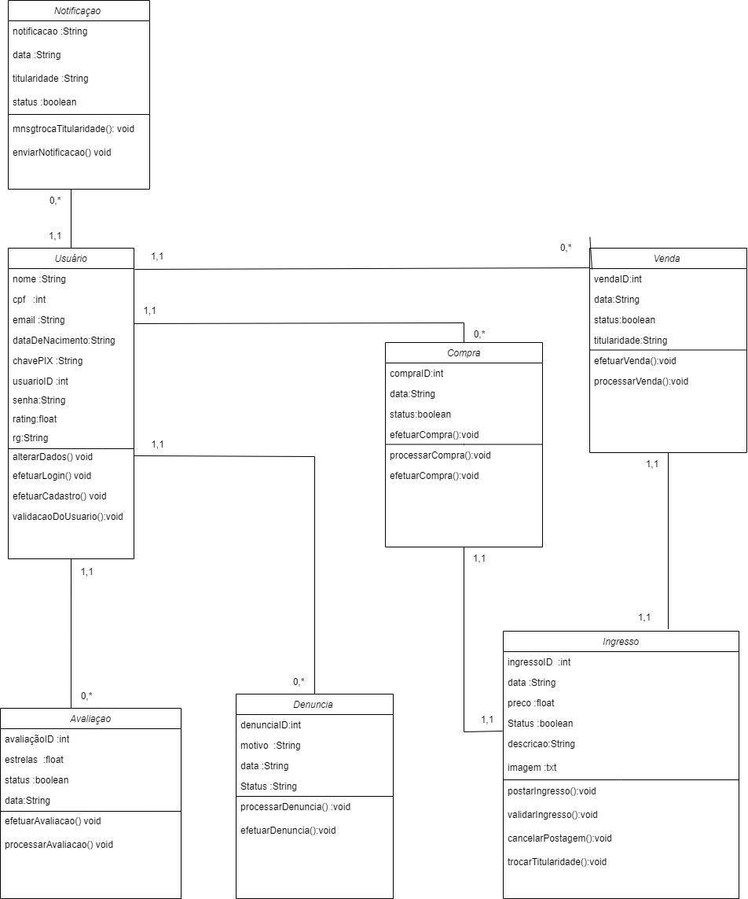
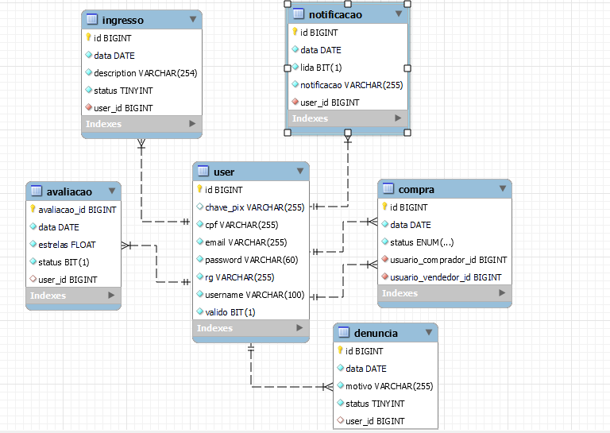
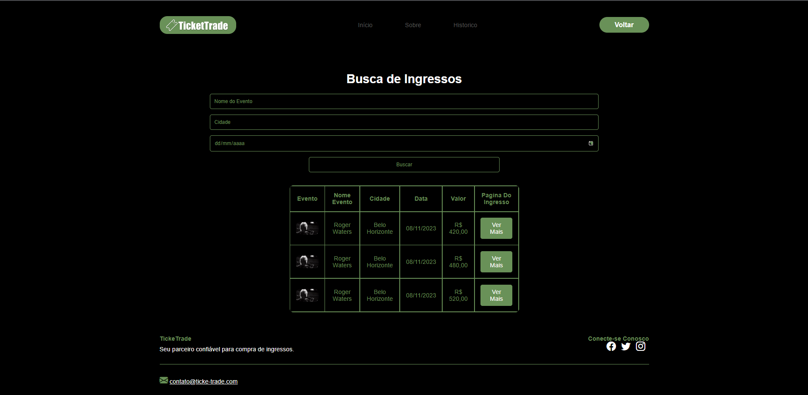
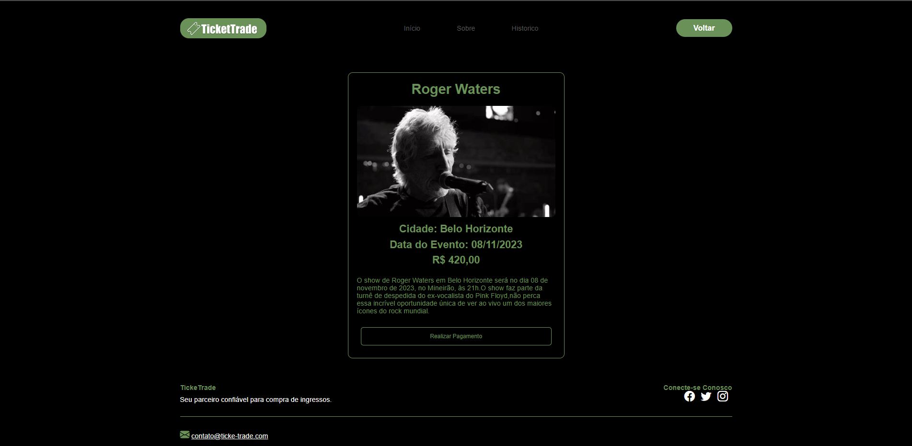
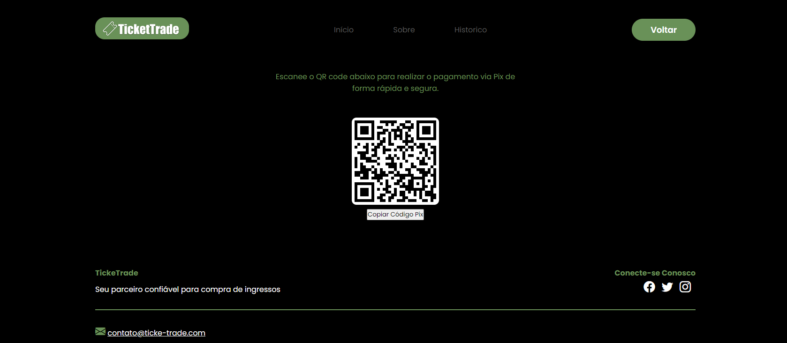
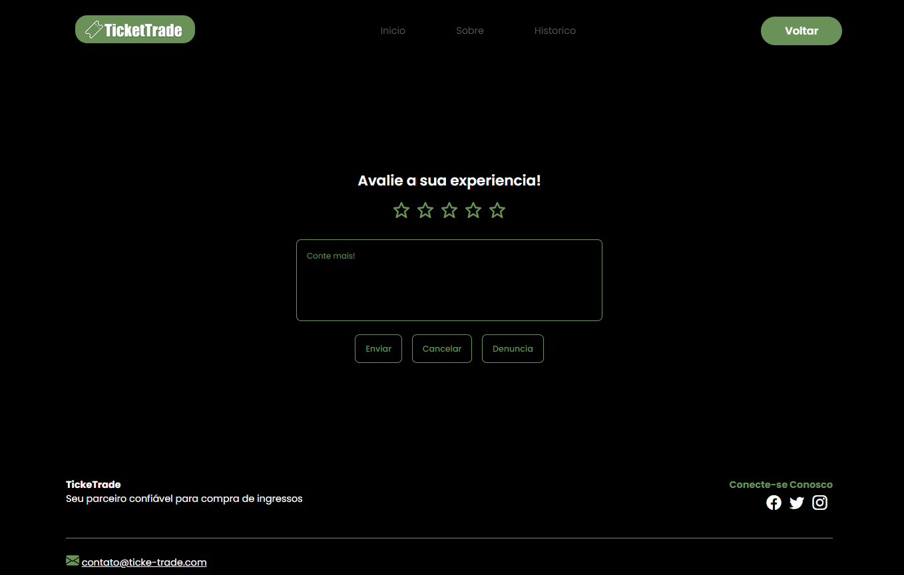

TicketTrade é um marketplace de revenda de ingressos para shows, eventos e palestras. O objetivo é resolver um problema comum: alguém comprou um ingresso e não vai mais usar, e precisa de um jeito seguro de repassá-lo para outra pessoa, sem depender de grupos informais ou golpes em redes sociais.

## Funcionalidades

- Cadastro e login de usuários, que podem atuar tanto como vendedores quanto compradores
- Anúncio de ingressos para revenda, com evento, cidade, data e preço
- Busca e filtro de ingressos disponíveis
- Pagamento via Pix (QR code e código copia-e-cola) ou boleto
- Pagamento retido sob controle do administrador até a confirmação da transferência do ingresso, protegendo o comprador
- Avaliação mútua entre comprador e vendedor após a transação
- Denúncia de usuários, com fila de revisão para o administrador
- Validação de ingressos submetidos pelo administrador

## Arquitetura

O sistema segue uma arquitetura simples de três camadas: uma interface web consome uma API REST em Spring Boot, que processa cadastro, venda e compra de ingressos e persiste tudo em MySQL via Hibernate.

O modelo de dados gira em torno de `Ingresso`, `Compra`, `Avaliacao`, `Denuncia` e `Notificacao`, todos associados a um `Usuario` que pode comprar ou vender.

## Telas

